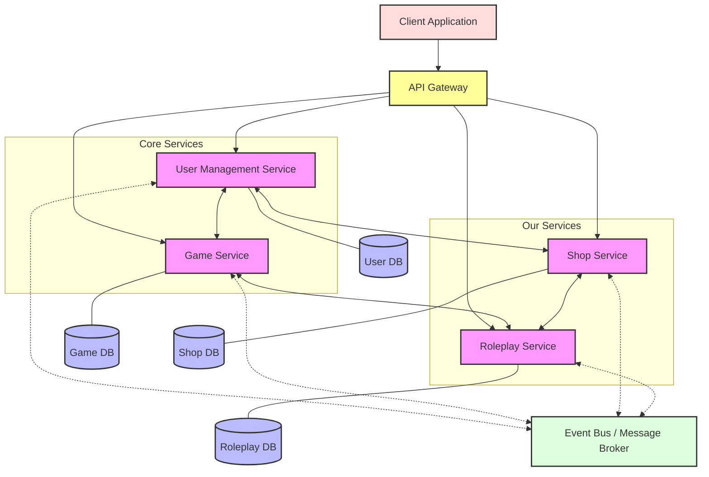

### Architecture Diagram



### Service Communication Patterns

The diagram above illustrates the communication flows between services in our Mafia Platform:

1. **Synchronous Communication**
   - The Shop Service communicates directly with the User Management Service for account validation and currency operations
   - The Roleplay Service communicates with the Game Service to update game state based on role actions
   - The Shop Service and Roleplay Service have bidirectional communication to handle item effects on actions

2. **Asynchronous Communication**
   - All services publish events to the Event Bus for asynchronous processing
   - The Game Service subscribes to Roleplay Service events to broadcast announcements
   - The Shop Service listens for game state changes to refresh daily items

3. **Database Isolation**
   - Each service maintains its own database
   - No direct cross-service database access is permitted
   - Data consistency is maintained through events and API calls

## Shop Service

**Responsibility**: Manages the in-game economy and item system

**Functionality**:
- Inventory management for in-game items
- Purchase processing using in-game currency
- Dynamic item availability (daily quantity balancing algorithm)
- Item effects management (e.g., protection attributes)
- Transaction history tracking
- Currency management

### Domain Models and Interfaces

#### Item
```typescript
interface Item {
  id: string;
  name: string;
  description: string;
  price: number;
  category: string;
  effects: ItemEffect[];
  availableQuantity: number;
  imageUrl: string;
  usageInstructions?: string;
  createdAt: Date;
}

interface ItemEffect {
  type: string;  // PROTECTION, ATTACK_BOOST, ROLE_REVEAL, etc.
  value: number;
  duration: number;
  targetRole?: string;
}
```

#### Inventory
```typescript
interface InventoryItem {
  id: string;
  userId: string;
  gameId: string;
  itemId: string;
  name: string;
  quantity: number;
  used: boolean;
  acquiredAt: Date;
  expiresAt?: Date;
  effects: ActiveItemEffect[];
}

interface ActiveItemEffect {
  type: string;
  value: number;
  duration: number;
  active: boolean;
}
```

#### Transaction
```typescript
interface Transaction {
  transactionId: string;
  userId: string;
  gameId: string;
  items: PurchasedItem[];
  totalCost: number;
  timestamp: Date;
  status: 'COMPLETED' | 'FAILED' | 'PENDING';
}

interface PurchasedItem {
  itemId: string;
  name: string;
  quantity: number;
  unitPrice: number;
  totalPrice: number;
}
```

#### Balance
```typescript
interface Balance {
  userId: string;
  gameId: string;
  balance: number;
  lastUpdated: Date;
}
```

### APIs Exposed

#### 1. Get Available Items

**Endpoint:** `GET /api/v1/items`

**Description:** Retrieves all available items for purchase in the shop.

**Response Format:**
```json
{
  "items": [
    {
      "id": "string",
      "name": "string",
      "description": "string",
      "price": 0,
      "category": "string",
      "effects": [
        {
          "type": "string",
          "value": 0,
          "duration": 0
        }
      ],
      "availableQuantity": 0,
      "imageUrl": "string"
    }
  ],
  "totalItems": 0,
  "totalPages": 0,
  "currentPage": 0
}
```

**Status Codes:**
- 200: Success
- 400: Invalid parameters
- 500: Server error

#### 2. Get Item Details

**Endpoint:** `GET /api/v1/items/{id}`

**Description:** Retrieves detailed information about a specific item.

**Path Parameters:**
- `id`: Unique identifier of the item

**Response Format:**
```json
{
  "id": "string",
  "name": "string",
  "description": "string",
  "price": 0,
  "category": "string",
  "effects": [
    {
      "type": "string",
      "value": 0,
      "duration": 0,
      "targetRole": "string"
    }
  ],
  "availableQuantity": 0,
  "imageUrl": "string",
  "usageInstructions": "string",
  "createdAt": "string (ISO-8601 format)"
}
```

**Status Codes:**
- 200: Success
- 404: Item not found
- 500: Server error

#### 3. Process Purchase

**Endpoint:** `POST /api/v1/purchases`

**Description:** Processes a purchase transaction for one or more items.

**Request Format:**
```json
{
  "userId": "string",
  "gameId": "string",
  "items": [
    {
      "itemId": "string",
      "quantity": 0
    }
  ]
}
```

**Response Format:**
```json
{
  "transactionId": "string",
  "status": "string",
  "timestamp": "string (ISO-8601 format)",
  "totalCost": 0,
  "remainingBalance": 0,
  "items": [
    {
      "itemId": "string",
      "name": "string",
      "quantity": 0,
      "unitPrice": 0,
      "totalPrice": 0
    }
  ],
  "message": "string"
}
```

**Status Codes:**
- 201: Purchase successful
- 404: Item not found
- 500: Server error

#### 4. View User Inventory

**Endpoint:** `GET /api/v1/inventory/{userId}`

**Description:** Retrieves the inventory of items owned by a user.

**Path Parameters:**
- `userId`: Unique identifier of the user

**Response Format:**
```json
{
  "userId": "string",
  "gameId": "string",
  "items": [
    {
      "id": "string",
      "itemId": "string",
      "name": "string",
      "quantity": 0,
      "used": false,
      "acquiredAt": "string (ISO-8601 format)",
      "expiresAt": "string (ISO-8601 format)",
      "effects": [
        {
          "type": "string",
          "value": 0,
          "duration": 0,
          "active": true
        }
      ]
    }
  ]
}
```

**Status Codes:**
- 200: Success
- 404: User not found or no inventory
- 500: Server error

#### 5. Check User Balance

**Endpoint:** `GET /api/v1/balance/{userId}`

**Description:** Checks the current game currency balance of a user.

**Path Parameters:**
- `userId`: Unique identifier of the user

**Query Parameters:**
- `gameId` (required): The game context for the balance

**Response Format:**
```json
{
  "userId": "string",
  "gameId": "string",
  "balance": 0,
  "lastUpdated": "string (ISO-8601 format)"
}
```

**Status Codes:**
- 200: Success
- 404: User or game not found
- 500: Server error

#### 6. Update User Balance

**Endpoint:** `PUT /api/v1/balance/{userId}`

**Description:** Updates the game currency balance of a user.

**Path Parameters:**
- `userId`: Unique identifier of the user

**Request Format:**
```json
{
  "gameId": "string",
  "amount": 0,
  "operation": "ADD|SUBTRACT|SET",
  "reason": "string"
}
```

**Response Format:**
```json
{
  "userId": "string",
  "gameId": "string",
  "previousBalance": 0,
  "currentBalance": 0,
  "transactionId": "string",
  "timestamp": "string (ISO-8601 format)"
}
```

**Status Codes:**
- 200: Success
- 404: User or game not found
- 500: Server error

### Implementation Considerations

- Implement daily item stock refresh algorithm
- Track purchase history for audit purposes
- Provide item effectiveness metadata for Roleplay Service
- Implement transaction locking to prevent race conditions

## Roleplay Service

**Responsibility**: Controls game mechanics related to player roles and actions

**Functionality**:
- Role assignment and management
- Processing role-specific actions (e.g., Mafia kills, Sheriff investigations)
- Checking item effectiveness during actions
- Recording all action attempts for audit purposes
- Creating filtered announcements for the Game Service to broadcast
- Enforcing role-specific rules and constraints

### Domain Models and Interfaces

#### Role
```typescript
interface Role {
  id: string;
  name: string;
  alignment: 'TOWN' | 'MAFIA' | 'NEUTRAL';
  description: string;
  abilities: Ability[];
  winCondition: string;
}

interface Ability {
  name: string;
  description: string;
  usablePhase: 'DAY' | 'NIGHT' | 'BOTH';
  cooldown: number;
  targets: number;  // Number of players that can be targeted
}
```

#### PlayerRole
```typescript
interface PlayerRole {
  userId: string;
  gameId: string;
  roleId: string;
  roleName: string;
  alignment: 'TOWN' | 'MAFIA' | 'NEUTRAL';
  abilities: PlayerAbility[];
  alive: boolean;
  protectionStatus: Protection[];
}

interface PlayerAbility {
  name: string;
  description: string;
  usablePhase: 'DAY' | 'NIGHT' | 'BOTH';
  cooldown: number;
  remainingCooldown: number;
  used: boolean;
  targets: number;
}

interface Protection {
  type: string;
  source: string;
  expiresAt: Date;
}
```

#### Action
```typescript
interface Action {
  actionId: string;
  gameId: string;
  userId: string;
  roleName: string;
  actionType: string;
  targets: string[];
  usedItems?: string[];
  gamePhase: 'DAY' | 'NIGHT';
  status: 'PENDING' | 'SUCCESS' | 'FAILED' | 'BLOCKED';
  results: ActionResult[];
  timestamp: Date;
}

interface ActionResult {
  targetId: string;
  outcome: string;
  visible: boolean;
  message: string;
}
```

#### Announcement
```typescript
interface Announcement {
  announcementId: string;
  gameId: string;
  message: string;
  visibleTo: ('ALL' | 'MAFIA' | 'TOWN' | 'SPECIFIC_ROLE' | 'SPECIFIC_USER')[];
  targetUsers?: string[];
  phase: 'DAY' | 'NIGHT';
  timestamp: Date;
}
```

### APIs Exposed

#### 1. Perform Role Action

**Endpoint:** `POST /api/v1/actions`

**Description:** Executes a role-specific action in the game.

**Request Format:**
```json
{
  "gameId": "string",
  "userId": "string",
  "actionType": "string",
  "targets": ["string"],
  "usedItems": ["string"],
  "gamePhase": "DAY|NIGHT",
  "timestamp": "string (ISO-8601 format)"
}
```

**Response Format:**
```json
{
  "actionId": "string",
  "status": "PENDING|SUCCESS|FAILED|BLOCKED",
  "results": [
    {
      "targetId": "string",
      "outcome": "string",
      "visible": true,
      "message": "string"
    }
  ],
  "timestamp": "string (ISO-8601 format)",
  "message": "string"
}
```

**Status Codes:**
- 201: Action submitted
- 404: User, game, or target not found
- 500: Server error

#### 2. Get Available Roles

**Endpoint:** `GET /api/v1/roles`

**Description:** Retrieves information about all available roles in the game.

**Response Format:**
```json
{
  "roles": [
    {
      "id": "string",
      "name": "string",
      "alignment": "TOWN|MAFIA|NEUTRAL",
      "description": "string",
      "abilities": [
        {
          "name": "string",
          "description": "string",
          "usablePhase": "DAY|NIGHT|BOTH",
          "cooldown": 0,
          "targets": 0
        }
      ],
      "winCondition": "string"
    }
  ]
}
```

**Status Codes:**
- 200: Success
- 500: Server error

#### 3. Get User Role

**Endpoint:** `GET /api/v1/roles/{userId}`

**Description:** Retrieves the role assigned to a specific user in a game.

**Path Parameters:**
- `userId`: Unique identifier of the user

**Query Parameters:**
- `gameId` (required): The game context for the role query

**Response Format:**
```json
{
  "userId": "string",
  "gameId": "string",
  "roleName": "string",
  "alignment": "TOWN|MAFIA|NEUTRAL",
  "abilities": [
    {
      "name": "string",
      "description": "string",
      "usablePhase": "DAY|NIGHT|BOTH",
      "cooldown": 0,
      "remainingCooldown": 0,
      "used": false,
      "targets": 0
    }
  ],
  "alive": true,
  "protectionStatus": [
    {
      "type": "string",
      "source": "string",
      "expiresAt": "string (ISO-8601 format)"
    }
  ]
}
```

**Status Codes:**
- 200: Success
- 404: User or game not found
- 500: Server error

#### 4. Create Game Announcement

**Endpoint:** `POST /api/v1/announcements`

**Description:** Creates a filtered game announcement based on game events.

**Request Format:**
```json
{
  "gameId": "string",
  "eventType": "string",
  "rawData": {
    "key1": "value1",
    "key2": "value2"
  },
  "visibleTo": ["ALL|MAFIA|TOWN|SPECIFIC_ROLE|SPECIFIC_USER"],
  "targetUsers": ["string"],
  "phase": "DAY|NIGHT",
  "timestamp": "string (ISO-8601 format)"
}
```

**Response Format:**
```json
{
  "announcementId": "string",
  "gameId": "string",
  "message": "string",
  "visibleTo": ["ALL|MAFIA|TOWN|SPECIFIC_ROLE|SPECIFIC_USER"],
  "targetUsers": ["string"],
  "phase": "DAY|NIGHT",
  "timestamp": "string (ISO-8601 format)"
}
```

**Status Codes:**
- 201: Announcement created
- 404: Game not found
- 500: Server error

#### 5. Get Action History

**Endpoint:** `GET /api/v1/actions/history`

**Description:** Retrieves the history of actions in a game (admin only).

**Query Parameters:**
- `gameId` (required): The game context for the action history

**Response Format:**
```json
{
  "actions": [
    {
      "actionId": "string",
      "gameId": "string",
      "userId": "string",
      "roleName": "string",
      "actionType": "string",
      "targets": ["string"],
      "usedItems": ["string"],
      "gamePhase": "DAY|NIGHT",
      "status": "PENDING|SUCCESS|FAILED|BLOCKED",
      "results": [
        {
          "targetId": "string",
          "outcome": "string",
          "visible": true,
          "message": "string"
        }
      ],
      "timestamp": "string (ISO-8601 format)"
    }
  ],
  "totalActions": 0,
  "totalPages": 0,
  "currentPage": 0
}
```

**Status Codes:**
- 200: Success
- 403: Unauthorized access
- 404: Game not found
- 500: Server error

#### 6. Get Action Results

**Endpoint:** `GET /api/v1/actions/results`

**Description:** Retrieves the results of actions for the current phase.

**Query Parameters:**
- `gameId` (required): The game context for the action results
- `userId` (required): The user requesting the results
- `phase` (required): Game phase (DAY, NIGHT)

**Response Format:**
```json
{
  "gameId": "string",
  "phase": "DAY|NIGHT",
  "results": [
    {
      "actionType": "string",
      "actor": "string",
      "targets": ["string"],
      "outcome": "string",
      "message": "string",
      "timestamp": "string (ISO-8601 format)"
    }
  ],
  "roleSpecificResults": [
    {
      "actionType": "string",
      "actor": "string",
      "targets": ["string"],
      "outcome": "string",
      "message": "string",
      "visibleTo": ["string"],
      "timestamp": "string (ISO-8601 format)"
    }
  ]
}
```

**Status Codes:**
- 200: Success
- 403: Unauthorized access
- 404: Game or user not found
- 500: Server error

### Inter-Service Event Formats

Beyond REST APIs, services communicate asynchronously via events. Below are the key event formats:

#### Shop Service Events

1. **Item Purchased Event**
```json
{
  "eventType": "ITEM_PURCHASED",
  "transactionId": "string",
  "userId": "string",
  "gameId": "string",
  "items": [
    {
      "itemId": "string",
      "name": "string",
      "quantity": 0,
      "effects": [
        {
          "type": "string",
          "value": 0,
          "duration": 0,
          "targetRole": "string"
        }
      ]
    }
  ],
  "timestamp": "string (ISO-8601 format)"
}
```

2. **Item Used Event**
```json
{
  "eventType": "ITEM_USED",
  "userId": "string",
  "gameId": "string",
  "itemId": "string",
  "inventoryItemId": "string",
  "targetUserId": "string",
  "effects": [
    {
      "type": "string",
      "value": 0,
      "duration": 0,
      "targetRole": "string"
    }
  ],
  "timestamp": "string (ISO-8601 format)"
}
```

#### Roleplay Service Events

1. **Action Completed Event**
```json
{
  "eventType": "ACTION_COMPLETED",
  "actionId": "string",
  "gameId": "string",
  "userId": "string",
  "roleName": "string",
  "actionType": "string",
  "targets": ["string"],
  "status": "SUCCESS|FAILED|BLOCKED",
  "publicOutcome": "string",
  "timestamp": "string (ISO-8601 format)"
}
```

2. **Player Status Changed Event**
```json
{
  "eventType": "PLAYER_STATUS_CHANGED",
  "userId": "string",
  "gameId": "string",
  "alive": true,
  "statusEffects": [
    {
      "type": "string",
      "source": "string",
      "expiresAt": "string (ISO-8601 format)"
    }
  ],
  "timestamp": "string (ISO-8601 format)"
}
```