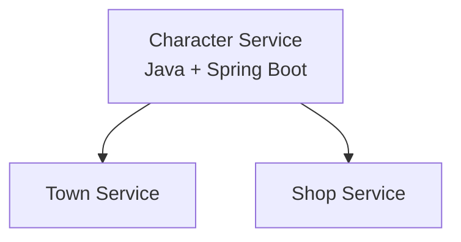

# Game Services Architecture

## Character Service

### Core Responsibility
Manages character customization, inventory, and appearance.

### Tech Stack
- **Framework/Language:** Java 17 + Spring Boot 3.2 (Spring MVC) – chosen for strong typing, consistent transaction management, and easier modeling of character entities
- **Database:** PostgreSQL for persistent storage + Redis for caching frequently accessed inventory data
- **Other:** Docker, Gradle, Git

### Communication Pattern
- **Synchronous:** REST APIs for character customization and inventory updates
- **Asynchronous:** Event publishing for inventory change notifications

### Service Diagram


### Schema
```typescript
interface Character {
    userId: string;
    gameId: string;
    appearance: CharacterAppearance;
    inventory: InventoryItem[];
}

interface CharacterAppearance {
    hairStyle: string;
    clothing: ClothingSet;
    accessories: string[];
}

interface InventoryItem {
    assetId: string;
    name: string;
    category: "CLOTHING" | "TOOL" | "ACCESSORY";
    isEquipped: boolean;
    effects: ItemEffect[];
}
```

### Endpoints

#### `GET v1/characters/{userId}`
Retrieve character data
- **Path Params:**
  1. `userId: string` – ID of the user
- **Query Params:**
  1. `gameId: string` – ID of the game

#### `PUT v1/characters/{userId}/customize`
Update character appearance
- **Request Body:**
```json
{
  "gameId": "game_456",
  "changes": {
    "hairStyle": "pompadour",
    "equippedItems": {
      "HAT": "fedora_001"
    }
  }
}
```

#### `POST v1/characters/{userId}/inventory/add`
Add item to inventory
- **Request Body:**
```json
{
  "gameId": "game_456",
  "assetId": "lockpick_001",
  "quantity": 1,
  "source": "SHOP"
}
```

### Dependencies
- **Town Service** – for applying effects to player movement (e.g., stealth, speed)
- **Shop Service** – for integrating purchased items into player inventories