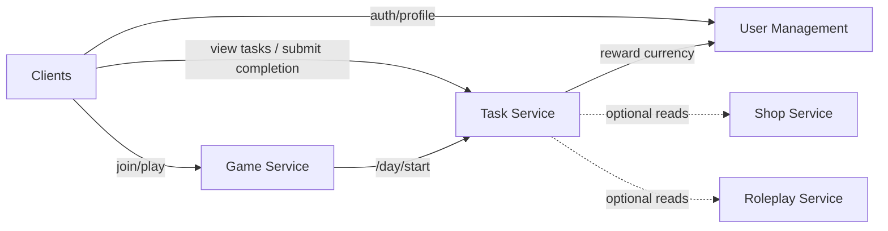

# distributed_applications_labs

## Task Service — Service Boundary
**Responsibility:** Assign daily tasks based on player role/career at day start, track completion, reward currency, and optionally generate rumors.

**Owns data (encapsulated):**
- `task_definitions`
- `daily_task_assignments`
- `task_events`

**Inputs:**
- Day start signal (from Game Service)
- Role/career info (from Game or Roleplay)
- Optional items/locations (from Shop/Game) for validation

**Outputs:**
- Assigned tasks to players
- Completion + reward events (to User Management for currency updates)
- Rumor events (to Communication/Roleplay)

**Clients:** Players (view tasks, submit completion), Game Service (triggers day start)

**Non-goals:** Authentication, currency storage, role logic, night actions, chat.

### Interfaces / Communication
- **Task ↔ Game Service:** Game starts the day; Task returns task assignments.
- **Task → User Management:** Request currency credit when tasks complete.
- **Task (optional reads) → Shop / Roleplay:** Validate item or role requirements.

### Architecture Diagram

