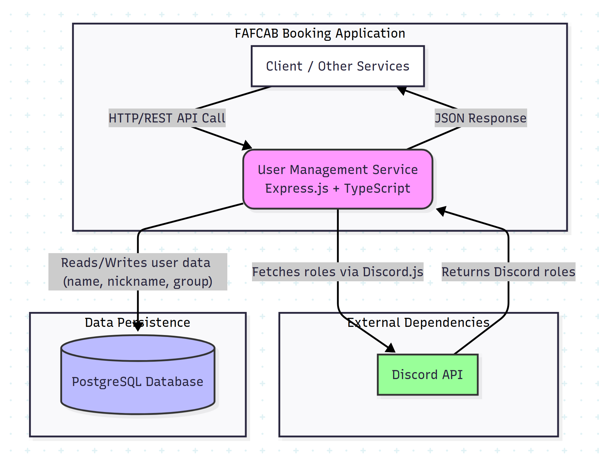

# distributed_applications_labs

## User Management Service

* **Core responsibility:** Handle requests regarding user information, where uses can have multiple roles which should be fetched from the Discord channel of FAF Community.
User data should include the name, the nickname, the student group and the role of the user.

### Tech stack

* **Framework/language:** express js with TypeScript because it allows for fast development and the Discord JS library supports a huge variety of features.
* **Databse:** PostgreSQL because it is easy to set up and has ORMs ready for TS
* **Other:** other technologies used
* **Communication pattern:** The server will represent a REST API for internal communication, along with a persisted db connection and will make requests to the Discord APIs through the Discord JS node module that uses `undici` as a HTTP\1.1 client.

### Service Diagram



### Schema

The models used by this service have to correspond with the real world needs of other services that need it.
Biggest part is the nickname, the name and the role of the user so that they can be handled in different ways.
Let's describe the schema with a set of interfaces.

```typescript
interface User {
    getId(): string;
    getName(): string;
    getNickname(): string;
    getDiscordRoles(): string[]; 
    getStudentGroup(): string;
}
```

### Endpoints

some boilerplate endpoint description

#### `GET v1/users/{id}` - Retrieve user by Id

**Path Params:**

1. `id: string` - id of the user to be retrieved

#### `GET v1/users` - Retrieve all users

**Query Params:**

1. `roles: string[]` - list of roles to filter users for

#### `POST v1/users` - Add a user

**Request Body Schema:**

Might be altered further on

```json
{
    name:"johndoe",
    discord_nickname:"johnybravo"
}
```

#### `PUT v1/users/{id}` - Update user data

**Request Body Schema:**

Take as request body a full object of the user to replace its data by the given ID

```json
{
    name:""
    nickname:"",
    roles:[],
    student_group:""
}
```

### Dependencies

* PostgreSQL DB Container
* Discord API Availability
