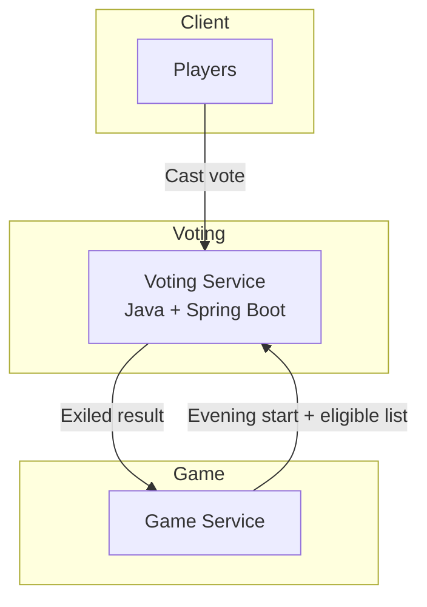

# distributed_applications_labs

## Voting Service

* **Core responsibility:** Manage the evening vote. Open voting sessions, collect one vote per eligible player, tally results, resolve ties, and return the exiled player to the Game Service.

### Tech stack

* **Framework/language:** Java + Spring Boot (strong concurrency support, production-grade for voting logic).  
* **Database:** PostgreSQL (ensures durability of votes, supports tally queries).  
* **Other:** Spring Data JPA (ORM), Jackson (JSON), Spring Security (for role-based access).  
* **Communication pattern:** REST API (JSON over HTTP) for synchronous operations. Future extension: publish `player.exiled` events via a broker.

### Service Diagram



## Schema
```java
class VoteWindow {
    UUID id;
    int day;
    boolean open;
    LocalDateTime openedAt;
    LocalDateTime closedAt;
}

class Vote {
    UUID id;
    UUID voterId;
    UUID targetUserId;
    int day;
    LocalDateTime createdAt;
}

class VoteResult {
    UUID id;
    int day;
    UUID exiledUserId;
    String tieBreakMethod;  // e.g., NONE, RANDOM
    LocalDateTime createdAt;
}
```
## Endpoints
`POST v1/votes/open` – Start a new voting session
Request
```json
{ "day": 12, "eligiblePlayers": ["uuid1", "uuid2"], "eligibleTargets": ["uuid3","uuid4"] }
```
Response 200
```json
{ "day": 12, "status": "OPEN", "closesAt": "2025-09-07T20:00:00Z" }
```
Errors
```json
{ "error": { "code": "VOTE_ALREADY_OPEN", "message": "A vote is already active" } }
```
`POST v1/votes` – Cast a vote
Headers: `Idempotency-Key: string`
Request
```json
{ "day": 12, "voterId": "uuid1", "targetUserId": "uuid2" }
```
Response 200
```json
{ "accepted": true, "voteId": "uuid" }
```
Errors
```json
{ "error": { "code": "ALREADY_VOTED", "message": "Voter already cast a vote" } }
```
`POST v1/votes/close` – Close voting and compute result
Request
```json
{ "day": 12 }
```
Response 200
```json
{
  "day": 12,
  "exiledUserId": "uuid2",
  "counts": [
    { "userId": "uuid2", "votes": 5 },
    { "userId": "uuid3", "votes": 3 }
  ],
  "tieBreakMethod": "RANDOM"
}
```
Errors
```json
{ "error": { "code": "NOT_OPEN", "message": "No vote is currently active" } }
```

## Dependencies
- Game Service: opens/closes vote windows, receives exile result.
- Clients (Players): cast votes via this service.

## Data ownership:
This service exclusively manages `vote_windows`, `votes`, and `vote_results`. No other service writes to this DB.
