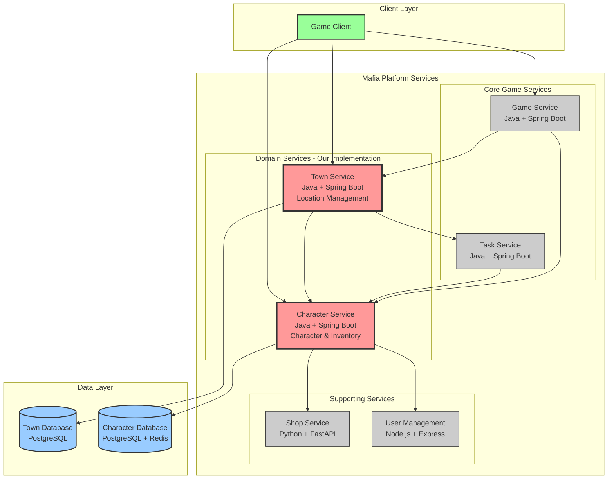
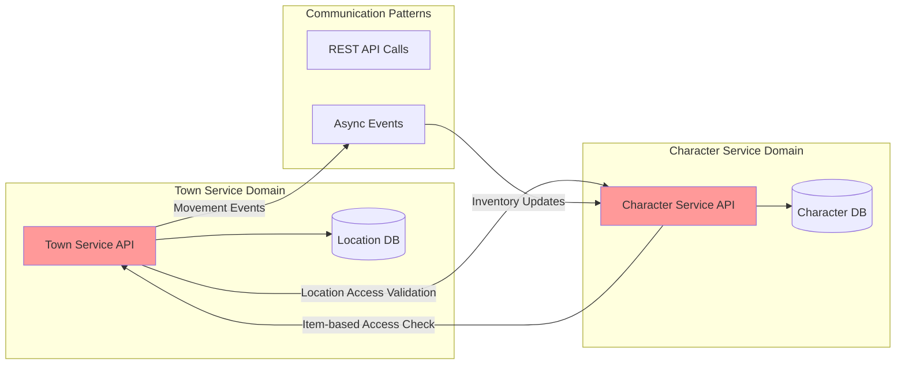
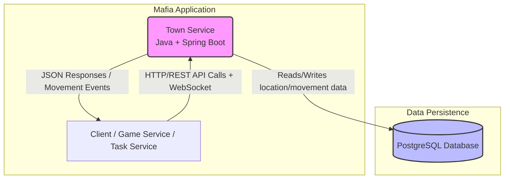
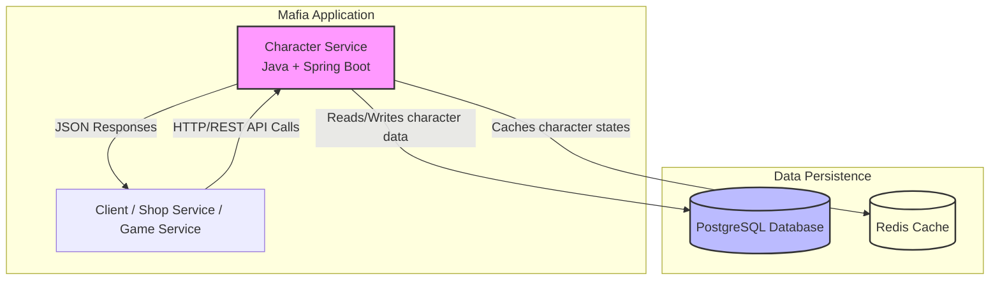
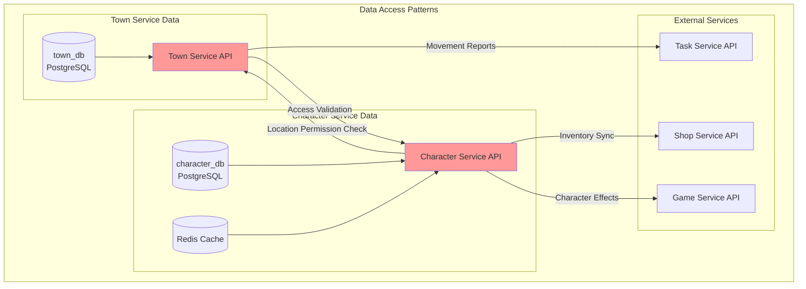

# distributed_applications_labs

## Service Boundaries Overview

### Town Service & Character Service Communication Architecture



### Focused Communication: Town ↔ Character Services



---

## Technologies and Communication Patterns

### Team Language Distribution
Our team implements services using **3 different programming languages** to leverage the strengths of each technology stack:

- **Java + Spring Boot**: Town Service, Character Service (our implementation)
- **Python + FastAPI**: Shop Service (team member implementation)
- **Node.js + Express**: User Management Service (team member implementation)

### Service Technologies

#### Town Service
- **Language**: Java 17
- **Framework**: Spring Boot 3.2 with Spring WebFlux
- **Database**: PostgreSQL 15 with spatial extensions
- **Caching**: Redis for location state caching
- **Additional Libraries**: 
  - Spring Data JPA for database operations
  - Spring WebSocket for real-time movement tracking
  - Jackson for JSON serialization
  - Micrometer for metrics

**Technology Justification for Mafia Platform Business Case**:
- **Concurrency Excellence**: Java's virtual threads (Project Loom) and Spring WebFlux enable handling thousands of simultaneous player movements without performance degradation - critical for a multiplayer mafia game where real-time location tracking is essential
- **Enterprise Reliability**: Spring Boot's production-ready features (health checks, metrics, security) ensure the Town Service can handle the high-stakes nature of mafia gameplay where system downtime could disrupt active games
- **Spatial Data Processing**: PostgreSQL's PostGIS extension combined with Java's robust geospatial libraries enable complex location-based queries needed for territory control and proximity-based game mechanics
- **Transaction Safety**: Java's strong typing and Spring's transaction management ensure movement logs are never corrupted, maintaining game integrity for investigations and alibis
- **Ecosystem Maturity**: Extensive security libraries available for implementing the secretive, authenticated nature of mafia platform communications

#### Character Service  
- **Language**: Java 17
- **Framework**: Spring Boot 3.2 with Spring MVC
- **Database**: PostgreSQL 15 for structured data, Redis for character state caching
- **Additional Libraries**:
  - Spring Data JPA with JSON support
  - Spring Cache abstraction
  - Bean Validation for data integrity
  - MapStruct for DTO mapping

**Technology Justification for Mafia Platform Business Case**:
- **Data Consistency**: Java's strong typing system and Spring's transaction management ensure inventory operations are atomic - when a character purchases disguise items, the transaction either completes entirely or fails entirely, preventing inventory corruption that could compromise gameplay
- **Complex Object Modeling**: Java's OOP capabilities excel at modeling the intricate character customization system where items have effects, restrictions, and relationships - essential for a mafia game where appearance and equipment directly impact gameplay mechanics
- **Secure State Management**: Spring Security integration enables role-based character access (family boss vs. street thug) with different customization privileges and inventory restrictions
- **Performance Optimization**: Redis integration provides sub-millisecond character state retrieval, crucial when multiple services need to validate character abilities during fast-paced mafia operations
- **JSON Flexibility**: PostgreSQL's JSON support combined with Jackson allows storing flexible character appearance data while maintaining query performance for complex inventory searches

### Communication Patterns

#### Synchronous Communication
- **REST APIs**: Primary communication method between all services
  - **Protocol**: HTTP/HTTPS with JSON payloads
  - **Authentication**: JWT tokens for secure inter-service communication
  - **Rate Limiting**: Implemented to prevent service abuse during high-intensity mafia operations
  - **Circuit Breaker**: Hystrix pattern to handle service failures gracefully

**Business Case Alignment**: REST ensures immediate response for critical operations like location access validation and inventory verification during time-sensitive mafia activities.

#### Asynchronous Communication
- **Event-Driven Architecture**: 
  - **Technology**: Apache Kafka for event streaming
  - **Pattern**: Publish-Subscribe for movement events and inventory changes
  - **Event Store**: Persistent event log for game activity auditing
- **Message Queuing**: 
  - **Technology**: RabbitMQ for reliable message delivery
  - **Use Cases**: Delayed notifications, batch inventory processing, activity reporting to Task Service

**Business Case Alignment**: Async patterns enable the platform to handle the secretive nature of mafia operations - events can be processed without blocking other operations, and the event store provides an immutable audit trail for investigations.

#### Real-Time Communication
- **WebSockets**: 
  - **Implementation**: Spring WebSocket with STOMP protocol
  - **Use Cases**: Live location updates, real-time character appearance changes during meetings
  - **Fallback**: Server-Sent Events (SSE) for browsers with limited WebSocket support

**Business Case Alignment**: Real-time updates are crucial for mafia gameplay where knowing who's where and what they're wearing can be life-or-death information.

### Trade-offs Analysis

#### Performance vs Complexity
- **Decision**: Multi-pattern communication (REST + Events + WebSockets)
- **Trade-off**: Increased system complexity for superior user experience
- **Business Impact**: Enhanced gameplay immersion justifies the architectural overhead - mafia games require seamless real-time interactions

#### Consistency vs Availability  
- **Decision**: Strong consistency for inventory, eventual consistency for location tracking
- **Trade-off**: Some location updates may have slight delays vs guaranteed inventory accuracy
- **Business Impact**: Financial transactions (shop purchases) require absolute accuracy, while location tracking can tolerate minor delays

#### Java Ecosystem vs Polyglot Architecture
- **Decision**: Java for both our services despite having Python/Node.js options
- **Trade-off**: Miss some language-specific benefits vs consistent development experience
- **Business Impact**: Faster development and easier maintenance outweigh potential performance gains from language optimization

#### Horizontal Scaling Considerations
- **Stateless Design**: Both services designed to be horizontally scalable
- **Database Partitioning**: Character data partitioned by game instance, location data by geographical regions
- **Cache Distribution**: Redis cluster setup for handling high-concurrency character state access
- **Load Balancing**: Spring Cloud Gateway for intelligent request routing based on user location and character activity patterns

### Security Architecture
Given the "high-risk, high-reward" nature of the Mafia Platform:

- **End-to-End Encryption**: All inter-service communication encrypted with TLS 1.3
- **Zero-Trust Model**: Every service call authenticated and authorized
- **Audit Logging**: Complete activity trails for forensic analysis
- **Data Anonymization**: Personal data encrypted at rest with rotating keys
- **Rate Limiting**: Aggressive throttling to prevent reconnaissance attacks on the platform

This technology stack provides the reliability, security, and performance needed for a clandestine gaming platform where system failures or data breaches could have serious consequences for the fictional "organization" and its members.

---

## Town Service
* **Core responsibility:** Manages all game world locations and tracks player movement patterns within the town.

**Functionality**:
- Location registry management (Shop, Informator Bureau, safe houses, etc.)
- Real-time player movement tracking between locations
- Location access control and restrictions enforcement
- Activity reporting to Task Service for task validation
- Location-based event triggers and interactions
- Movement history and analytics

### Tech stack
* **Framework/language:** Java + Spring Boot (robust concurrency for real-time tracking, excellent ecosystem)
* **Database:** PostgreSQL (spatial data support for locations, transaction safety for movement logs)
* **Other:** WebSocket support via Spring WebSocket, Spring Data JPA, Jackson for JSON
* **Communication pattern:** REST API + WebSocket for real-time updates + Event publishing

### Service Diagram


### Schema
```typescript
interface Location {
    id: string;
    name: string;
    type: LocationType;
    description: string;
    accessRules: AccessRule[];
    capacity?: number;
    coordinates: { x: number, y: number };
    isActive: boolean;
    createdAt: string;
}

enum LocationType {
    SHOP,
    INFORMATOR_BUREAU,
    SAFE_HOUSE,
    PUBLIC_AREA,
    RESTRICTED_ZONE
}

interface AccessRule {
    requirement: string;  // ROLE, ITEM, TIME_WINDOW
    value: string;
    allowed: boolean;
}

interface PlayerMovement {
    id: string;
    userId: string;
    gameId: string;
    fromLocationId?: string;
    toLocationId: string;
    timestamp: string;
    duration?: number;  // time spent at location
    purpose?: string;   // TASK, SHOPPING, INVESTIGATION
}

interface LocationActivity {
    id: string;
    locationId: string;
    userId: string;
    activityType: ActivityType;
    metadata: Record<string, any>;
    reportedToTaskService: boolean;
    timestamp: string;
}

enum ActivityType {
    VISIT,
    PURCHASE,
    INVESTIGATION,
    MEETING,
    TASK_COMPLETION
}
```

### Endpoints

#### `GET v1/locations` – Get all available locations
Response 200:
```json
{
  "locations": [
    {
      "id": "uuid",
      "name": "Central Shop",
      "type": "SHOP",
      "description": "Main shopping area",
      "accessRules": [],
      "capacity": 50,
      "coordinates": { "x": 10, "y": 20 },
      "isActive": true
    }
  ]
}
```

#### `POST v1/movements` – Record player movement
Request:
```json
{
  "userId": "uuid",
  "gameId": "uuid", 
  "toLocationId": "uuid",
  "purpose": "TASK"
}
```

Response 201:
```json
{
  "movementId": "uuid",
  "fromLocation": "Previous Location",
  "toLocation": "New Location", 
  "timestamp": "2025-09-08T10:00:00Z",
  "accessGranted": true
}
```

#### `GET v1/movements/{userId}/history` – Get movement history
Query params: `gameId`, `limit`, `offset`

Response 200:
```json
{
  "movements": [
    {
      "locationName": "Central Shop",
      "timestamp": "2025-09-08T10:00:00Z",
      "duration": 300,
      "purpose": "SHOPPING"
    }
  ]
}
```

### Dependencies
* Task Service: reports activities for task validation
* Game Service: receives location-based events
* Character Service: validates location access based on inventory

---

## Character Service
* **Core responsibility:** Manages player character customization and inventory system.

**Functionality**:
- Character appearance customization system
- Inventory management for purchased and earned items
- Asset catalog management (clothing, accessories, tools)
- Slot-based customization system (hair, coat, accessories)
- Character state persistence and synchronization
- Item effect tracking for gameplay mechanics

### Tech stack
* **Framework/language:** Java + Spring Boot (consistent enterprise-grade architecture, excellent ORM support)
* **Database:** PostgreSQL (JSON support for flexible customization data, ACID properties for inventory consistency)
* **Other:** Redis for caching character states, Jackson for JSON processing, Spring Data JPA
* **Communication pattern:** REST API + Event publishing for inventory changes

### Service Diagram


### Schema
```typescript
interface Character {
    id: string;
    userId: string;
    gameId: string;
    appearance: CharacterAppearance;
    inventory: InventoryItem[];
    customizationSlots: CustomizationSlot[];
    lastUpdated: string;
    createdAt: string;
}

interface CharacterAppearance {
    skinTone: string;
    hairStyle: string;
    hairColor: string;
    eyeColor: string;
    clothing: ClothingSet;
    accessories: string[];
}

interface ClothingSet {
    hat?: string;
    shirt: string;
    pants: string;
    shoes: string;
    coat?: string;
}

interface InventoryItem {
    id: string;
    assetId: string;
    name: string;
    category: AssetCategory;
    quantity: number;
    acquiredFrom: 'SHOP' | 'REWARD' | 'TASK';
    effects: ItemEffect[];
    isEquipped: boolean;
    acquiredAt: string;
}

interface CustomizationSlot {
    slotType: SlotType;
    equippedAssetId?: string;
    restrictions: string[];  // role, level, or item requirements
}

enum SlotType {
    HAIR,
    HAT,
    SHIRT,
    PANTS, 
    SHOES,
    COAT,
    ACCESSORY_1,
    ACCESSORY_2,
    TOOL
}

enum AssetCategory {
    HAIR,
    CLOTHING,
    ACCESSORY,
    TOOL,
    CONSUMABLE
}

interface Asset {
    id: string;
    name: string;
    description: string;
    category: AssetCategory;
    imageUrl: string;
    rarity: 'COMMON' | 'RARE' | 'LEGENDARY';
    requirements: AssetRequirement[];
    effects: ItemEffect[];
}

interface AssetRequirement {
    type: 'ROLE' | 'LEVEL' | 'ITEM';
    value: string;
}

interface ItemEffect {
    type: 'STEALTH' | 'CHARISMA' | 'PROTECTION' | 'SPEED';
    value: number;
    duration?: number;
}
```

### Endpoints

#### `GET v1/characters/{userId}` – Get character data
Query params: `gameId`

Response 200:
```json
{
  "id": "uuid",
  "userId": "uuid", 
  "appearance": {
    "skinTone": "light",
    "hairStyle": "short",
    "hairColor": "brown",
    "clothing": {
      "shirt": "casual-blue",
      "pants": "jeans",
      "shoes": "sneakers"
    }
  },
  "inventory": [
    {
      "id": "uuid",
      "name": "Leather Coat",
      "category": "CLOTHING",
      "quantity": 1,
      "isEquipped": false,
      "effects": [
        {
          "type": "PROTECTION",
          "value": 10
        }
      ]
    }
  ]
}
```

#### `PUT v1/characters/{userId}/customize` – Update character appearance
Request:
```json
{
  "gameId": "uuid",
  "changes": {
    "hairStyle": "long",
    "equippedItems": {
      "COAT": "leather-coat-001"
    }
  }
}
```

Response 200:
```json
{
  "success": true,
  "character": {
    "appearance": { /* updated appearance */ },
    "activeEffects": [
      {
        "type": "PROTECTION",
        "value": 10,
        "source": "Leather Coat"
      }
    ]
  }
}
```

#### `GET v1/assets` – Get available customization assets
Query params: `category`, `rarity`, `availableOnly`

Response 200:
```json
{
  "assets": [
    {
      "id": "uuid",
      "name": "Fedora Hat",
      "category": "CLOTHING",
      "imageUrl": "https://assets.game/fedora.png",
      "rarity": "RARE",
      "requirements": [
        {
          "type": "ROLE",
          "value": "DETECTIVE"
        }
      ]
    }
  ]
}
```

#### `POST v1/characters/{userId}/inventory/add` – Add item to inventory
Request:
```json
{
  "gameId": "uuid",
  "assetId": "uuid",
  "quantity": 1,
  "source": "SHOP"
}
```

Response 201:
```json
{
  "inventoryItemId": "uuid",
  "message": "Item added to inventory"
}
```

### Dependencies
* Shop Service: receives purchased items
* Town Service: validates location-based item usage
* Game Service: applies character effects to gameplay
* User Management Service: validates user ownership

---

## Communication Contract Between Services

### Data Management Strategy

#### Database Architecture
Each microservice maintains **database autonomy** following the microservices principle of data ownership:

- **Town Service**: Dedicated PostgreSQL database (`town_db`) with spatial extensions
- **Character Service**: Dedicated PostgreSQL database (`character_db`) + Redis cache
- **No Shared Databases**: Services communicate exclusively through well-defined APIs
- **Data Consistency**: Each service is the single source of truth for its domain data

#### Inter-Service Data Access Patterns



### Service Communication Contracts

## Town Service API Contract

### Authentication
All endpoints require JWT Bearer token in Authorization header:
```
Authorization: Bearer <jwt_token>
```

### Base URL
```
https://api.mafia-platform.com/town/v1
```

### Endpoints Specification

#### 1. **GET /locations** - Retrieve All Available Locations
**Purpose**: Get complete list of locations available in the town

**Request Headers**:
```http
Authorization: Bearer <jwt_token>
Content-Type: application/json
```

**Query Parameters**:
```typescript
interface LocationQueryParams {
    gameId?: string;           // Filter by game instance
    type?: LocationType;       // Filter by location type
    isActive?: boolean;        // Filter active/inactive locations
    userRole?: string;         // Filter by user access level
}
```

**Response 200 - Success**:
```json
{
  "status": "success",
  "data": {
    "locations": [
      {
        "id": "loc_001",
        "name": "Central Shop",
        "type": "SHOP",
        "description": "Main shopping area for acquiring tools and disguises",
        "accessRules": [
          {
            "requirement": "ROLE",
            "value": "MEMBER",
            "allowed": true
          }
        ],
        "capacity": 50,
        "currentOccupancy": 12,
        "coordinates": {
          "x": 150.5,
          "y": 200.3
        },
        "isActive": true,
        "availableActions": ["SHOP", "MEET", "OBSERVE"],
        "createdAt": "2025-09-01T10:00:00Z"
      }
    ],
    "totalCount": 15
  },
  "timestamp": "2025-09-08T14:30:00Z"
}
```

**Response 401 - Unauthorized**:
```json
{
  "status": "error",
  "error": {
    "code": "UNAUTHORIZED",
    "message": "Invalid or expired token"
  },
  "timestamp": "2025-09-08T14:30:00Z"
}
```

**Response 403 - Forbidden**:
```json
{
  "status": "error",
  "error": {
    "code": "ACCESS_DENIED",
    "message": "Insufficient privileges to view locations"
  },
  "timestamp": "2025-09-08T14:30:00Z"
}
```

---

#### 2. **POST /movements** - Record Player Movement
**Purpose**: Register a player's movement from one location to another

**Request Headers**:
```http
Authorization: Bearer <jwt_token>
Content-Type: application/json
```

**Request Body**:
```json
{
  "userId": "user_123",
  "gameId": "game_456",
  "toLocationId": "loc_002",
  "fromLocationId": "loc_001",
  "purpose": "TASK",
  "metadata": {
    "transportMethod": "WALKING",
    "isStealthy": false,
    "witnesses": []
  }
}
```

**Request Schema**:
```typescript
interface MovementRequest {
  userId: string;              // Required: User identifier
  gameId: string;              // Required: Game instance ID
  toLocationId: string;        // Required: Destination location
  fromLocationId?: string;     // Optional: Origin location (null for spawn)
  purpose: MovementPurpose;    // Required: Reason for movement
  metadata?: MovementMetadata; // Optional: Additional context
}

enum MovementPurpose {
  TASK = "TASK",
  SHOPPING = "SHOPPING", 
  INVESTIGATION = "INVESTIGATION",
  MEETING = "MEETING",
  ESCAPE = "ESCAPE"
}

interface MovementMetadata {
  transportMethod?: "WALKING" | "VEHICLE" | "TELEPORT";
  isStealthy?: boolean;
  witnesses?: string[];
  duration?: number;
}
```

**Response 201 - Movement Successful**:
```json
{
  "status": "success",
  "data": {
    "movementId": "mov_789",
    "userId": "user_123",
    "fromLocation": {
      "id": "loc_001",
      "name": "Central Shop"
    },
    "toLocation": {
      "id": "loc_002", 
      "name": "Informator Bureau"
    },
    "timestamp": "2025-09-08T14:35:00Z",
    "accessGranted": true,
    "travelTime": 120,
    "effects": {
      "suspicionLevel": 0,
      "energyCost": 10
    }
  },
  "timestamp": "2025-09-08T14:35:00Z"
}
```

**Response 400 - Invalid Movement**:
```json
{
  "status": "error",
  "error": {
    "code": "INVALID_MOVEMENT",
    "message": "Cannot move to restricted location without proper clearance",
    "details": {
      "missingRequirements": ["BOSS_APPROVAL"],
      "currentUserRole": "ASSOCIATE"
    }
  },
  "timestamp": "2025-09-08T14:35:00Z"
}
```

**Response 409 - Location Full**:
```json
{
  "status": "error",
  "error": {
    "code": "LOCATION_CAPACITY_EXCEEDED",
    "message": "Target location has reached maximum capacity",
    "details": {
      "maxCapacity": 10,
      "currentOccupancy": 10,
      "estimatedWaitTime": 300
    }
  },
  "timestamp": "2025-09-08T14:35:00Z"
}
```

---

#### 3. **GET /movements/{userId}/history** - Get Movement History
**Purpose**: Retrieve a user's movement history for investigation or tracking

**Path Parameters**:
- `userId` (string): User identifier

**Query Parameters**:
```typescript
interface MovementHistoryParams {
  gameId: string;              // Required: Game instance
  limit?: number;              // Default: 50, Max: 200
  offset?: number;             // Default: 0
  startDate?: string;          // ISO 8601 format
  endDate?: string;            // ISO 8601 format
  locationId?: string;         // Filter by specific location
  purpose?: MovementPurpose;   // Filter by movement purpose
}
```

**Response 200 - Success**:
```json
{
  "status": "success",
  "data": {
    "movements": [
      {
        "id": "mov_789",
        "fromLocation": {
          "id": "loc_001",
          "name": "Central Shop"
        },
        "toLocation": {
          "id": "loc_002",
          "name": "Informator Bureau"
        },
        "timestamp": "2025-09-08T14:35:00Z",
        "duration": 300,
        "purpose": "INVESTIGATION",
        "metadata": {
          "transportMethod": "WALKING",
          "witnesses": ["user_456", "user_789"]
        }
      }
    ],
    "pagination": {
      "total": 150,
      "limit": 50,
      "offset": 0,
      "hasMore": true
    }
  },
  "timestamp": "2025-09-08T14:40:00Z"
}
```

---

#### 4. **GET /locations/{locationId}/occupancy** - Get Real-Time Location Status
**Purpose**: Check current occupancy and activity at a specific location

**Path Parameters**:
- `locationId` (string): Location identifier

**Response 200 - Success**:
```json
{
  "status": "success",
  "data": {
    "locationId": "loc_001",
    "locationName": "Central Shop",
    "currentOccupancy": 12,
    "maxCapacity": 50,
    "occupancyRate": 0.24,
    "activeUsers": [
      {
        "userId": "user_123",
        "characterName": "Tony Montana",
        "arrivedAt": "2025-09-08T14:30:00Z",
        "activity": "SHOPPING"
      }
    ],
    "averageVisitDuration": 420,
    "lastUpdated": "2025-09-08T14:40:00Z"
  },
  "timestamp": "2025-09-08T14:40:00Z"
}
```

---

#### 5. **POST /locations/{locationId}/report-activity** - Report Location Activity
**Purpose**: External services report activities happening at locations

**Path Parameters**:
- `locationId` (string): Location where activity occurred

**Request Body**:
```json
{
  "userId": "user_123",
  "gameId": "game_456",
  "activityType": "PURCHASE",
  "description": "Purchased disguise kit",
  "metadata": {
    "itemsPurchased": ["disguise_001", "lockpick_002"],
    "totalAmount": 500,
    "vendorId": "vendor_001"
  },
  "reportedBy": "shop-service",
  "timestamp": "2025-09-08T14:45:00Z"
}
```

**Response 201 - Activity Recorded**:
```json
{
  "status": "success",
  "data": {
    "activityId": "act_001",
    "reportedToTaskService": true,
    "suspicionGenerated": false,
    "message": "Activity recorded and reported successfully"
  },
  "timestamp": "2025-09-08T14:45:00Z"
}
```

---

## Character Service API Contract

### Base URL
```
https://api.mafia-platform.com/character/v1
```

### Endpoints Specification

#### 1. **GET /characters/{userId}** - Get Character Data
**Purpose**: Retrieve complete character information including appearance and inventory

**Path Parameters**:
- `userId` (string): User identifier

**Query Parameters**:
```typescript
interface CharacterQueryParams {
  gameId: string;              // Required: Game instance
  includeInventory?: boolean;  // Default: true
  includeEffects?: boolean;    // Default: true
  includeHistory?: boolean;    // Default: false
}
```

**Response 200 - Success**:
```json
{
  "status": "success",
  "data": {
    "character": {
      "id": "char_001",
      "userId": "user_123",
      "gameId": "game_456",
      "appearance": {
        "skinTone": "medium",
        "hairStyle": "slicked-back",
        "hairColor": "black",
        "eyeColor": "brown",
        "clothing": {
          "hat": "fedora_001",
          "shirt": "suit-shirt_001",
          "pants": "dress-pants_001", 
          "shoes": "leather-shoes_001",
          "coat": "trench-coat_001"
        },
        "accessories": ["gold-watch_001", "cigarette-case_001"]
      },
      "inventory": [
        {
          "id": "inv_001",
          "assetId": "lockpick_002",
          "name": "Professional Lockpick Set",
          "category": "TOOL",
          "quantity": 1,
          "acquiredFrom": "SHOP",
          "acquiredAt": "2025-09-08T10:30:00Z",
          "effects": [
            {
              "type": "STEALTH",
              "value": 15,
              "duration": null
            }
          ],
          "isEquipped": true,
          "condition": "EXCELLENT"
        }
      ],
      "activeEffects": [
        {
          "type": "CHARISMA",
          "value": 25,
          "source": "Expensive Suit",
          "duration": null,
          "appliedAt": "2025-09-08T14:00:00Z"
        }
      ],
      "stats": {
        "totalItems": 15,
        "equippedItems": 8,
        "totalEffectValue": 75,
        "prestigeLevel": "MADE_MAN"
      },
      "lastUpdated": "2025-09-08T14:45:00Z",
      "createdAt": "2025-09-01T10:00:00Z"
    }
  },
  "timestamp": "2025-09-08T14:50:00Z"
}
```

**Response 404 - Character Not Found**:
```json
{
  "status": "error",
  "error": {
    "code": "CHARACTER_NOT_FOUND",
    "message": "No character found for user in specified game"
  },
  "timestamp": "2025-09-08T14:50:00Z"
}
```

---

#### 2. **PUT /characters/{userId}/customize** - Update Character Appearance
**Purpose**: Modify character appearance and equipment

**Path Parameters**:
- `userId` (string): User identifier

**Request Body**:
```json
{
  "gameId": "game_456",
  "changes": {
    "appearance": {
      "hairStyle": "pompadour",
      "hairColor": "grey"
    },
    "equippedItems": {
      "HAT": "bowler_001",
      "COAT": null,
      "ACCESSORY_1": "gold-chain_001"
    },
    "unequipItems": ["trench-coat_001"]
  },
  "validateOnly": false
}
```

**Request Schema**:
```typescript
interface CustomizationRequest {
  gameId: string;
  changes: {
    appearance?: Partial<CharacterAppearance>;
    equippedItems?: Record<SlotType, string | null>;
    unequipItems?: string[];
  };
  validateOnly?: boolean;  // True to check validity without applying
}
```

**Response 200 - Customization Successful**:
```json
{
  "status": "success",
  "data": {
    "character": {
      "appearance": {
        "hairStyle": "pompadour",
        "hairColor": "grey",
        "clothing": {
          "hat": "bowler_001",
          "shirt": "suit-shirt_001",
          "pants": "dress-pants_001",
          "shoes": "leather-shoes_001",
          "coat": null
        },
        "accessories": ["gold-chain_001", "cigarette-case_001"]
      },
      "activeEffects": [
        {
          "type": "CHARISMA",
          "value": 30,
          "source": "Gold Chain",
          "duration": null
        }
      ],
      "effectsChanged": [
        {
          "effect": "CHARISMA",
          "previousValue": 25,
          "newValue": 30,
          "change": "+5"
        }
      ]
    },
    "message": "Character customization applied successfully"
  },
  "timestamp": "2025-09-08T14:55:00Z"
}
```

**Response 400 - Invalid Customization**:
```json
{
  "status": "error",
  "error": {
    "code": "INVALID_CUSTOMIZATION",
    "message": "Cannot equip item due to restrictions",
    "details": {
      "invalidItems": [
        {
          "itemId": "boss-ring_001",
          "reason": "Requires BOSS role",
          "currentRole": "ASSOCIATE"
        }
      ]
    }
  },
  "timestamp": "2025-09-08T14:55:00Z"
}
```

---

#### 3. **GET /assets** - Get Available Customization Assets
**Purpose**: Retrieve catalog of available customization items

**Query Parameters**:
```typescript
interface AssetQueryParams {
  category?: AssetCategory;     // Filter by asset type
  rarity?: string;             // COMMON, RARE, LEGENDARY
  availableOnly?: boolean;     // Show only assets user can access
  userRole?: string;           // Current user role for filtering
  priceRange?: string;         // Format: "min-max"
  search?: string;             // Search in name/description
  limit?: number;              // Default: 50
  offset?: number;             // Default: 0
}
```

**Response 200 - Success**:
```json
{
  "status": "success",
  "data": {
    "assets": [
      {
        "id": "fedora_premium_001",
        "name": "Premium Fedora",
        "description": "High-quality fedora that commands respect",
        "category": "CLOTHING",
        "subcategory": "HAT",
        "imageUrl": "https://assets.mafia-platform.com/hats/fedora_premium.png",
        "rarity": "RARE",
        "price": 750,
        "requirements": [
          {
            "type": "ROLE",
            "value": "MADE_MAN"
          },
          {
            "type": "LEVEL", 
            "value": "10"
          }
        ],
        "effects": [
          {
            "type": "CHARISMA",
            "value": 20
          },
          {
            "type": "STEALTH",
            "value": 5
          }
        ],
        "isAvailable": true,
        "inStock": true,
        "tags": ["formal", "intimidating", "classic"]
      }
    ],
    "pagination": {
      "total": 342,
      "limit": 50,
      "offset": 0,
      "hasMore": true
    },
    "categories": [
      {
        "name": "CLOTHING",
        "count": 156,
        "subcategories": ["HAT", "SHIRT", "PANTS", "SHOES", "COAT"]
      },
      {
        "name": "ACCESSORY", 
        "count": 98,
        "subcategories": ["JEWELRY", "TOOLS", "WEAPONS"]
      }
    ]
  },
  "timestamp": "2025-09-08T15:00:00Z"
}
```

---

#### 4. **POST /characters/{userId}/inventory/add** - Add Item to Inventory
**Purpose**: Add purchased or earned items to character inventory

**Path Parameters**:
- `userId` (string): User identifier

**Request Body**:
```json
{
  "gameId": "game_456",
  "items": [
    {
      "assetId": "lockpick_premium_001",
      "quantity": 1,
      "source": "SHOP",
      "purchasePrice": 300,
      "metadata": {
        "vendorId": "vendor_001",
        "transactionId": "txn_123",
        "purchaseLocation": "loc_001"
      }
    }
  ],
  "autoEquip": true
}
```

**Response 201 - Items Added**:
```json
{
  "status": "success",
  "data": {
    "addedItems": [
      {
        "inventoryItemId": "inv_025",
        "assetId": "lockpick_premium_001",
        "name": "Premium Lockpick Set",
        "quantity": 1,
        "autoEquipped": true,
        "slot": "TOOL",
        "effectsApplied": [
          {
            "type": "STEALTH",
            "value": 25
          }
        ]
      }
    ],
    "inventory": {
      "totalItems": 16,
      "totalValue": 4750,
      "freeSlots": 34
    },
    "message": "Items added successfully to inventory"
  },
  "timestamp": "2025-09-08T15:05:00Z"
}
```

---

#### 5. **DELETE /characters/{userId}/inventory/{itemId}** - Remove Item from Inventory
**Purpose**: Remove items from inventory (sell, discard, or consume)

**Path Parameters**:
- `userId` (string): User identifier
- `itemId` (string): Inventory item identifier

**Request Body**:
```json
{
  "gameId": "game_456",
  "reason": "SOLD",
  "quantity": 1,
  "metadata": {
    "sellPrice": 200,
    "buyerId": "vendor_001"
  }
}
```

**Response 200 - Item Removed**:
```json
{
  "status": "success",
  "data": {
    "removedItem": {
      "inventoryItemId": "inv_025",
      "name": "Premium Lockpick Set",
      "quantityRemoved": 1,
      "remainingQuantity": 0
    },
    "effectsRemoved": [
      {
        "type": "STEALTH",
        "value": 25
      }
    ],
    "message": "Item removed from inventory"
  },
  "timestamp": "2025-09-08T15:10:00Z"
}
```

---

### Cross-Service Communication Patterns

#### Character ↔ Town Service Integration

**1. Location Access Validation**
When a user attempts to move to a restricted location, Town Service validates with Character Service:

```http
POST /character/v1/validate-location-access
{
  "userId": "user_123",
  "gameId": "game_456", 
  "locationId": "loc_restricted_001",
  "requiredItems": ["boss-key_001"],
  "requiredRole": "CAPO"
}
```

**2. Item-Based Location Effects**
Character Service notifies Town Service of equipped items that affect movement:

```http
POST /town/v1/apply-character-effects
{
  "userId": "user_123",
  "gameId": "game_456",
  "effects": [
    {
      "type": "STEALTH",
      "value": 30,
      "source": "Shadow Cloak"
    }
  ]
}
```

#### Error Handling Contract

All services follow consistent error response format:

```typescript
interface ErrorResponse {
  status: "error";
  error: {
    code: string;           // Machine-readable error code
    message: string;        // Human-readable description
    details?: any;          // Additional context
    retryable?: boolean;    // Whether request can be retried
    retryAfter?: number;    // Seconds to wait before retry
  };
  timestamp: string;        // ISO 8601 format
  requestId?: string;       // For tracing
}
```

#### Rate Limiting
All endpoints implement rate limiting with headers:

```http
X-RateLimit-Limit: 100
X-RateLimit-Remaining: 85
X-RateLimit-Reset: 1694184000
X-RateLimit-Window: 3600
```

#### Data Consistency Guarantees

- **Strong Consistency**: Inventory operations, character customization
- **Eventual Consistency**: Location occupancy updates, activity reports
- **Idempotency**: All POST/PUT operations support idempotency keys
- **Transactional**: Critical operations wrapped in distributed transactions where needed

## Data Ownership:
- **Town Service** exclusively manages: `locations`, `player_movements`, `location_activities`, `occupancy_data`
- **Character Service** exclusively manages: `characters`, `assets`, `inventory_items`, `customization_slots`, `character_effects`
- **Shared Concepts** (accessed via APIs only): User authentication, game instances, cross-service validations