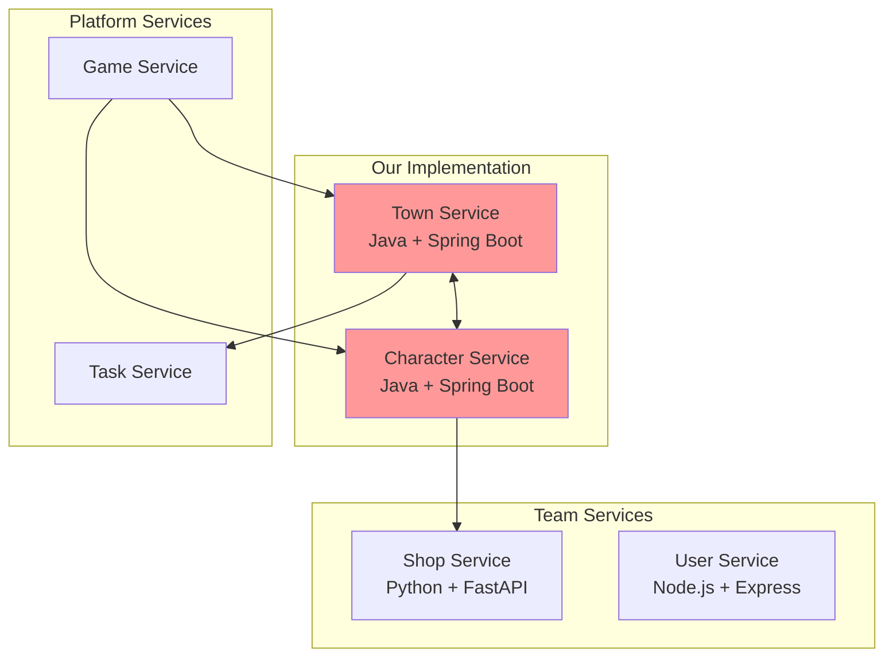

# Distributed Applications Labs - Mafia Platform

## Service Boundaries Overview

Our microservices architecture implements two core services within the larger Mafia Platform ecosystem:



### Service Responsibilities

**Town Service**: Manages game world locations, player movement tracking, and location-based access control.

**Character Service**: Handles character customization, inventory management, and appearance systems.

---

## Technologies and Communication Patterns

### Team Language Distribution (3 Languages)
- **Java + Spring Boot**: Town Service, Character Service (our focus)
- **Python + FastAPI**: Shop Service (team member)
- **Node.js + Express**: User Service (team member)

### Technology Justification

#### Town Service - Java + Spring Boot
- **Framework**: Spring Boot 3.2 with WebFlux
- **Database**: PostgreSQL with spatial extensions
- **Why**: Excellent concurrency for real-time movement tracking, robust transaction management for movement logs, mature ecosystem for location-based queries

#### Character Service - Java + Spring Boot  
- **Framework**: Spring Boot 3.2 with Spring MVC
- **Database**: PostgreSQL + Redis cache
- **Why**: Strong typing for complex inventory operations, JSON support for flexible character data, atomic transactions for inventory consistency

### Communication Patterns

**Synchronous**: REST APIs for immediate operations (location validation, inventory updates)
**Asynchronous**: Event publishing for movement notifications and inventory changes
**Real-time**: WebSockets for live location updates

---

## Town Service

**Core responsibility:** Manages game locations and tracks player movement

### Schema
```typescript
interface Location {
    id: string;
    name: string;
    type: "SHOP" | "SAFE_HOUSE" | "PUBLIC_AREA";
    accessRules: AccessRule[];
    coordinates: { x: number, y: number };
}

interface PlayerMovement {
    userId: string;
    gameId: string;
    toLocationId: string;
    timestamp: string;
    purpose: "TASK" | "SHOPPING" | "INVESTIGATION";
}
```

### Key Endpoints

#### `GET /v1/locations` - Get available locations
**Response**:
```json
{
  "locations": [
    {
      "id": "loc_001",
      "name": "Central Shop",
      "type": "SHOP",
      "coordinates": { "x": 10, "y": 20 }
    }
  ]
}
```

#### `POST /v1/movements` - Record movement
**Request**:
```json
{
  "userId": "user_123",
  "gameId": "game_456",
  "toLocationId": "loc_002",
  "purpose": "TASK"
}
```

**Response**:
```json
{
  "movementId": "mov_789",
  "accessGranted": true,
  "timestamp": "2025-09-08T14:35:00Z"
}
```

#### `GET /v1/movements/{userId}/history` - Movement history
Query params: `gameId`, `limit`, `startDate`

---

## Character Service

**Core responsibility:** Manages character customization and inventory

### Schema
```typescript
interface Character {
    userId: string;
    gameId: string;
    appearance: CharacterAppearance;
    inventory: InventoryItem[];
}

interface CharacterAppearance {
    hairStyle: string;
    clothing: ClothingSet;
    accessories: string[];
}

interface InventoryItem {
    assetId: string;
    name: string;
    category: "CLOTHING" | "TOOL" | "ACCESSORY";
    isEquipped: boolean;
    effects: ItemEffect[];
}
```

### Key Endpoints

#### `GET /v1/characters/{userId}` - Get character data
Query params: `gameId`

**Response**:
```json
{
  "character": {
    "appearance": {
      "hairStyle": "slicked-back",
      "clothing": {
        "shirt": "suit-shirt_001",
        "coat": "trench-coat_001"
      }
    },
    "inventory": [
      {
        "name": "Lockpick Set",
        "category": "TOOL",
        "isEquipped": true,
        "effects": [{"type": "STEALTH", "value": 15}]
      }
    ]
  }
}
```

#### `PUT /v1/characters/{userId}/customize` - Update appearance
**Request**:
```json
{
  "gameId": "game_456",
  "changes": {
    "hairStyle": "pompadour",
    "equippedItems": {
      "HAT": "fedora_001"
    }
  }
}
```

#### `POST /v1/characters/{userId}/inventory/add` - Add items
**Request**:
```json
{
  "gameId": "game_456",
  "assetId": "lockpick_001",
  "quantity": 1,
  "source": "SHOP"
}
```

---

## Communication Contracts

### Data Management
- **Separate Databases**: Each service owns its data (town_db, character_db)
- **API-only Communication**: No direct database access between services
- **Strong Consistency**: Inventory transactions
- **Eventual Consistency**: Location updates

### Cross-Service Integration

**Town → Character**: Location access validation
```http
POST /character/v1/validate-access
{"userId": "user_123", "locationId": "loc_001", "requiredRole": "MEMBER"}
```

**Character → Town**: Movement effects
```http
POST /town/v1/apply-effects  
{"userId": "user_123", "effects": [{"type": "STEALTH", "value": 20}]}
```

### Error Handling
All services use consistent error format:
```json
{
  "status": "error",
  "error": {
    "code": "ACCESS_DENIED",
    "message": "Insufficient privileges"
  }
}
```

---

## GitHub Workflow

### Branch Strategy
- **main**: Production-ready code
- **development**: Integration branch
- **feature/**: New features (`feature/town-websockets`)
- **bugfix/**: Bug fixes (`bugfix/inventory-sync`)
- **hotfix/**: Critical fixes (`hotfix/security-patch`)

### Branch Protection
- **main**: 2 approvals required, all CI checks must pass
- **development**: 1 approval required, tests must pass
- No direct pushes to protected branches

### Pull Request Process
1. **Title Format**: `type(scope): description`
   - Example: `feat(town-service): add real-time location tracking`
2. **Required Checks**: Build, tests, security scan, code coverage (80% minimum)
3. **Review Requirements**: Code owner approval + peer review
4. **Merge Strategy**: Squash and merge for feature branches

### CI/CD Pipeline
```yaml
# Automated checks for every PR:
- Build and compile
- Unit tests (80% coverage minimum)
- Integration tests  
- Security vulnerability scan
- Code quality analysis (SonarQube)
- Performance tests
```

### Code Quality Standards
- **Test Coverage**: Minimum 80%
- **Code Style**: Google Java Style Guide
- **Security**: OWASP dependency check
- **Documentation**: API docs updated with changes

### Development Setup
```bash
# Required tools
Java 17+, Gradle 8.0+, Docker, Git

# Pre-commit hooks
- Code formatting
- Test execution
- Security checks
```

This workflow ensures consistent, high-quality code delivery while maintaining security and performance standards for the Mafia Platform.