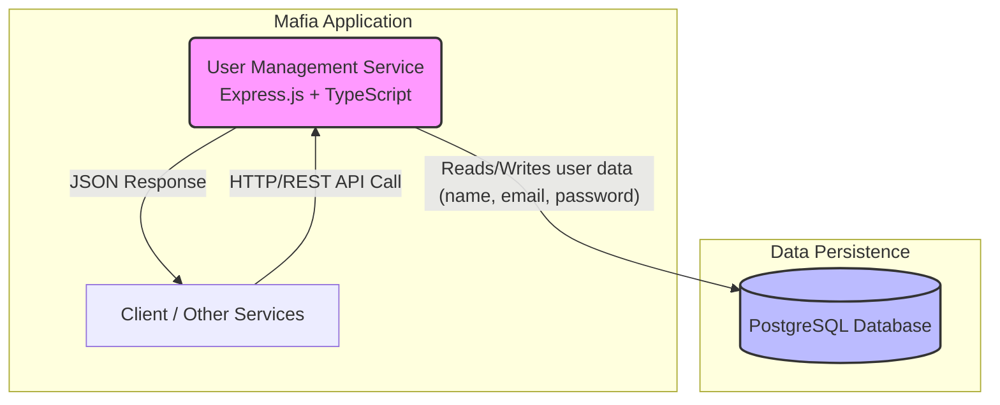
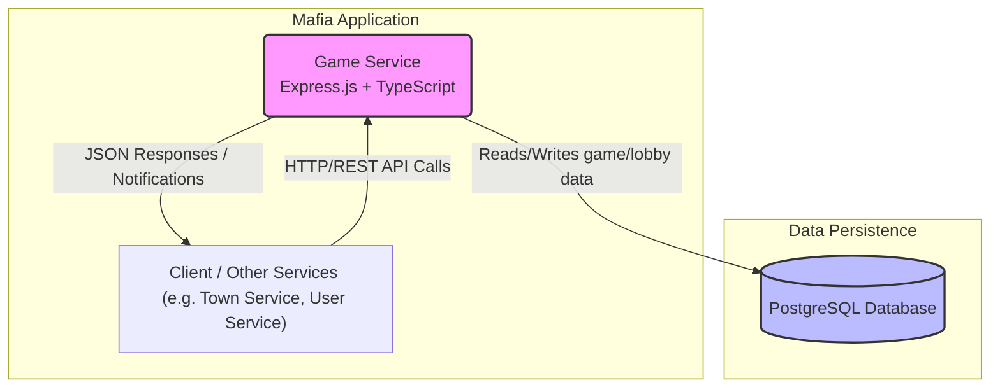

# distributed_applications_labs

## User Management Service

* **Core responsibility:** Single user profile (email, username, hashed password) + in‑game currency balance.
* Track simple profiling info: device fingerprints and last known IP/location to discourage duplicate accounts.
* Keep it minimal; no government/passport style identification.

### Tech stack

* **Framework/language:** Express.js + TypeScript (fast iteration, typing)
* **Database:** PostgreSQL (transactions for currency updates)
* **Other:** Password hashing library (argon2/bcrypt)
* **Communication pattern:** Internal REST API + direct DB persistence

### Service Diagram



### Schema

Minimal types only.

```typescript
interface User {
    id: string;
    email: string;        // unique
    username: string;     // unique
    passwordHash: string; // not exposed
    currency: number;     // float
    transactions: CurrencyTransaction[];
    lastIp?: string;
    lastCountry?: string;
    devices: Device[];
    updatedAt: string;
    createdAt: string;
}

enum DevicePlatform {
    WEB,
    ANDROID,
    IOS,
    DESKTOP
}

interface Device {
    id: string;
    userId: string;
    fingerprint: string;  // stable hash
    platform: DevicePlatform;
    lastSeenAt: string;
}

enum TransactionType {
    ADD,
    SUBTRACT
}

interface CurrencyTransaction {
    id: string;
    userId: string;
    transactionType: TransactionType; 
    resultingBalance: number; // after apply
    createdAt: string;
}
```

### Endpoints

Minimal set for MVP.

#### `GET v1/users/{id}` – Retrieve user by ID

Returns a user DAO

```typescript
interface UserDao {
    id: string;
    email: string;
    username: string;
    currency: number;
    lastCountry?: string;
    updatedAt: string;
    createdAt: string;
}
```

#### `GET v1/users` - List method with optional filters

**Query Params:**

* `username` - string, query by username
* `email` - string, query by email

#### `POST v1/users` – Create user

Body:

```json
{
    "email": "user@example.com",
    "username": "playerOne",
    "password": "PlainPassword!", // hash on the server
    "initialDevice": { "fingerprint": "sha256:abcd...", "platform": "web" },
    "initialLocation": { "country": "DE" }
}
```

Responses: 201 | 409 (email/username in use).

#### `POST v1/users/{id}/devices` – Register device

Body:

```json
{ "fingerprint": "sha256:abcd...", "platform": "web" }
```

Same fingerprint updates timestamp.

#### `GET v1/users/{id}/devices` – List devices

Returns array of device metadata.

#### `POST v1/users/{id}/currency` - Add a transaction to the user

Body:

```json
{ "amount": 500, "reason": "REWARD", "type":"ADD" }
```

#### `GET v1/users/{id}/currency/transactions` – History

### Dependencies

* PostgreSQL DB Container
* Password hashing lib (argon2/bcrypt)
* (Optional later) Message broker for events

## Game service

* **Core responsibility:** Main gameplay logic. Should handle lobbies of up to 30 players, track player state (alive/dead, role, career) and orchestrate the Day/Night cycle.
Should send notifications about events/announcements (kill, heal, rumor, visit, exile).
Initiates and manages the voting process before announcing exiles.

### Tech stack

* **Framework/language:** Express.js + TypeScript (consistent with other services and fast prototyping)
* **Databse:** PostgreSQL (data persistence, versatile DB)
* **Other:** Event/Notification mechanism via REST and WebSockets (consider upgrade to message brokers).
* **Communication pattern:** Internal REST API

### Service Diagram



### Schema

describe participating models and their schemas e.g.

```typescript
interface Lobby {
    id: string;
    name: string;
    players: Player[];
    dayNightCycle: CycleState;
    createdAt: string;
    updatedAt: string;
}

interface Player {
    id: string;
    userId: string;    // link to User Service
    lobbyId: string;
    role: Role;
    career: Career;
    isAlive: boolean;
    joinedAt: string;
}

enum Role {
    MAFIA,
    DOCTOR,
    DETECTIVE,
    VILLAGER
    // extendable
}

enum Career {
    LAWYER,
    JOURNALIST,
    MERCHANT,
    SOLDIER
    // flavor / abilities in future
}

enum CycleState {
    DAY,
    NIGHT
}

interface GameEvent {
    id: string;
    lobbyId: string;
    type: EventType;
    description: string;
    createdAt: string;
}

enum EventType {
    KILL,
    HEAL,
    RUMOR,
    VISIT,
    EXILE,
    ANNOUNCEMENT
}

interface Vote {
    id: string;
    lobbyId: string;
    voterPlayerId: string;
    targetPlayerId?: string; // optional (abstain)
    createdAt: string;
}
```

### Endpoints

#### `POST v1/lobbies` – Create new lobby

Request body

```json
{ "name": "Lobby 1" }
```

#### `POST v1/lobbies/{id}/join` – Add player to lobby

Body:

```json
{ "userId": "uuid-of-user", "role": "VILLAGER", "career": "MERCHANT" }
```

Response: Player object.
Errors: 409 (lobby full or already joined).

#### `GET v1/lobbies/{id}` – Retrieve lobby state

### Dependencies

* PostgreSQL DB container

* Express.js + TypeScript runtime

* (Optional later) Message broker for real-time announcements (e.g. Kafka, RabbitMQ, or WebSocket layer)
