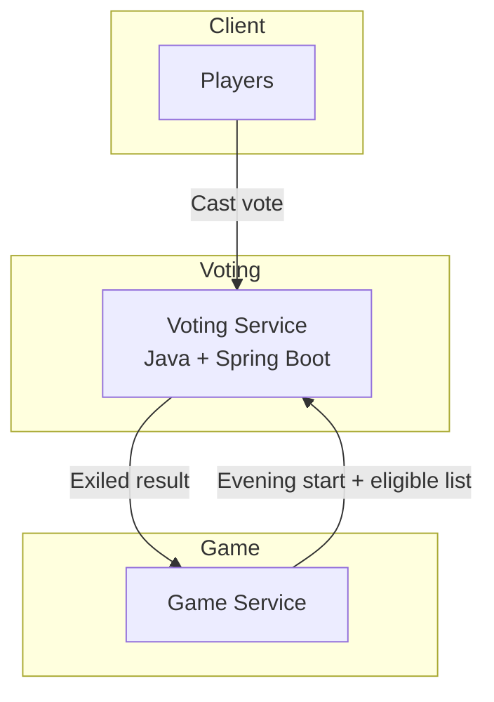

# distributed_applications_labs

## Voting Service

* **Core responsibility:** Manage the evening vote. Open voting sessions, collect one vote per eligible player, tally results, resolve ties, and return the exiled player to the Game Service.

### Tech stack

* **Framework/language:** Java + Spring Boot (strong concurrency support, production-grade for voting logic).  
* **Database:** PostgreSQL (ensures durability of votes, supports tally queries).  
* **Other:** Spring Data JPA (ORM), Jackson (JSON), Spring Security (for role-based access).  
* **Communication pattern:** REST API (JSON over HTTP) for synchronous operations. Future extension: publish `player.exiled` events via a broker.

### Service Diagram



## Schema
```java
class VoteWindow {
    UUID id;
    int day;
    boolean open;
    LocalDateTime openedAt;
    LocalDateTime closedAt;
}

class Vote {
    UUID id;
    UUID voterId;
    UUID targetUserId;
    int day;
    LocalDateTime createdAt;
}

class VoteResult {
    UUID id;
    int day;
    UUID exiledUserId;
    String tieBreakMethod;  // e.g., NONE, RANDOM
    LocalDateTime createdAt;
}
```
Endpoints
`POST v1/votes/open` – Start a new voting session
Body:
```json
{ "day": 12, "eligiblePlayers": ["uuid1", "uuid2"] }
```
Response:
```json
{ "day": 12, "status": "OPEN", "closesAt": "2025-09-07T20:00:00Z" }
```

`POST v1/votes` – Cast a vote
Body:
```json
{ "day": 12, "voterId": "uuid1", "targetUserId": "uuid2" }
```
Response:
```json
{ "accepted": true, "voteId": "uuid" }
```
`POST v1/votes/close` – Close voting and compute result
Body:
```json
{ "day": 12 }
```
Response:
```json
{ "day": 12, "exiledUserId": "uuid2", "tieBreakMethod": "RANDOM" }
```
## Dependencies
- Game Service: triggers the opening and closing of voting sessions; receives final exile result.
- Clients (Players): cast their votes through the service.


