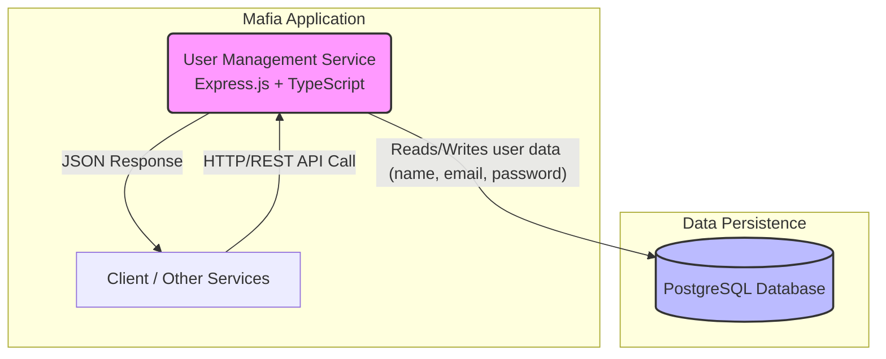
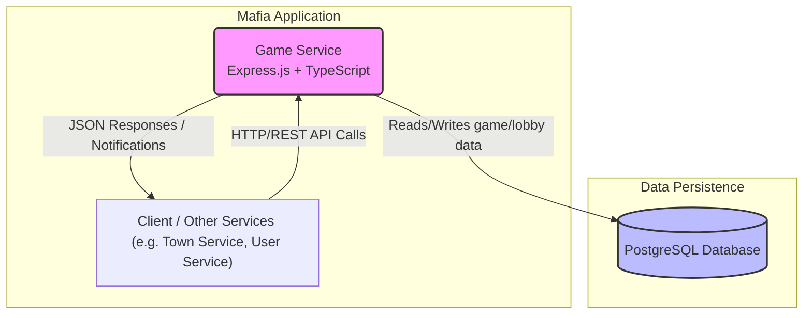
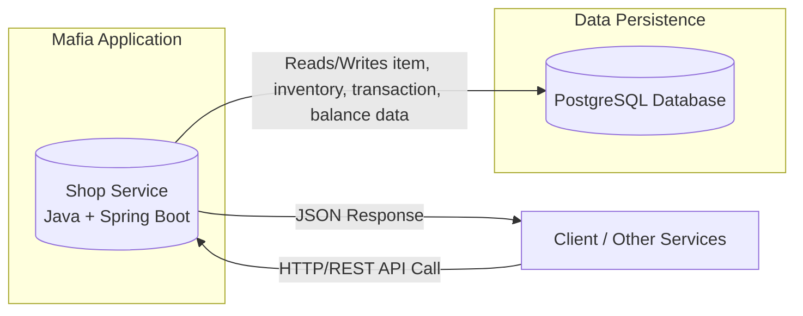
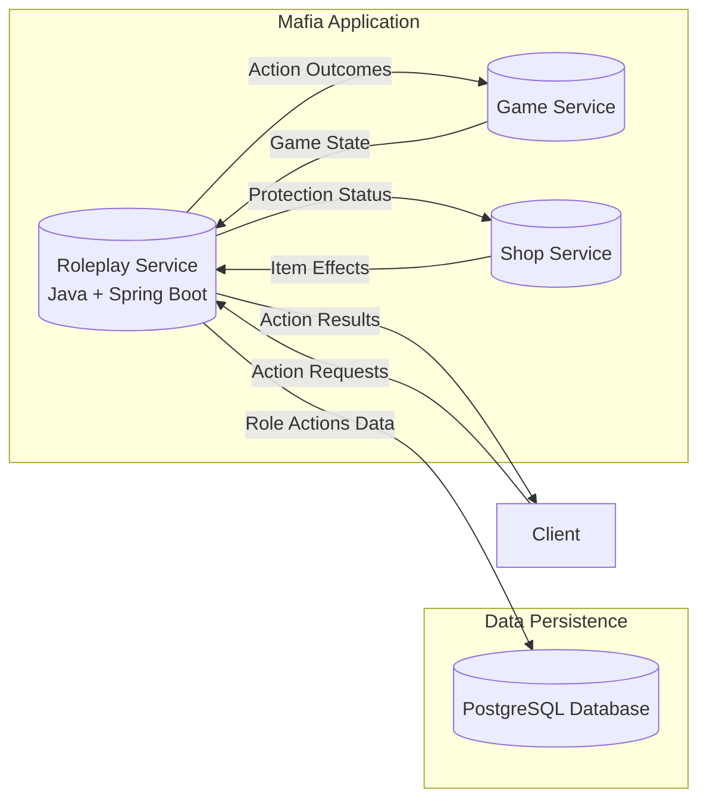
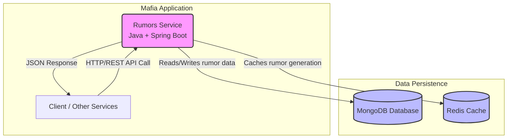
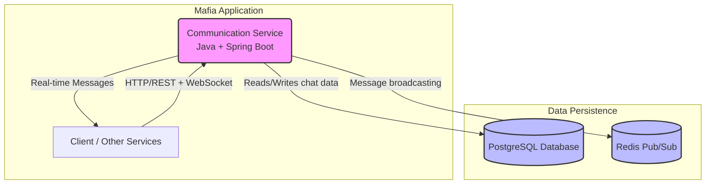
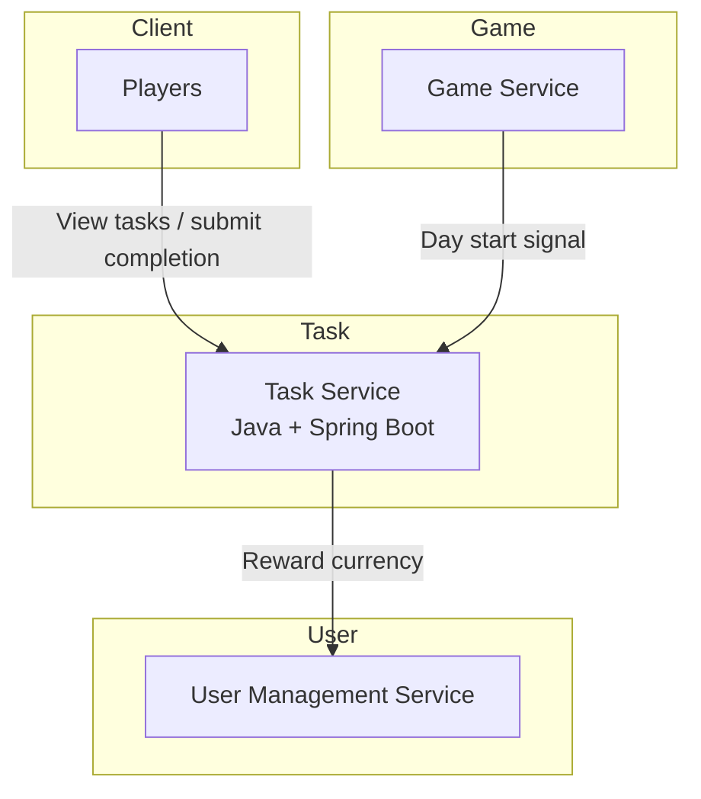
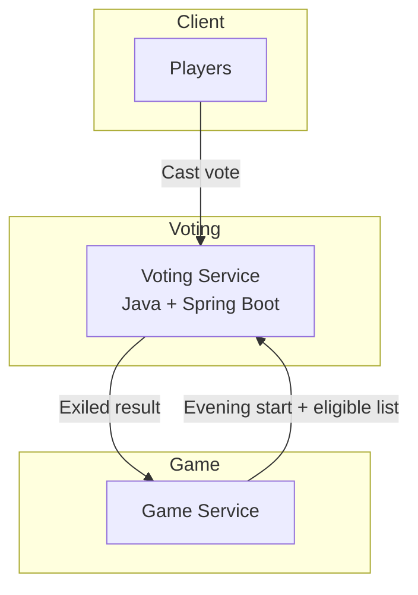

# distributed_applications_labs

## User Management Service

* **Core responsibility:** Single user profile (email, username, hashed password) + in‑game currency balance.
* Track simple profiling info: device fingerprints and last known IP/location to discourage duplicate accounts.
* Keep it minimal; no government/passport style identification.

### Tech stack

* **Framework/language:** Express.js + TypeScript (fast iteration, typing)
* **Database:** PostgreSQL (transactions for currency updates)
* **Other:** Password hashing library (argon2/bcrypt)
* **Communication pattern:** Internal REST API + direct DB persistence

### Service Diagram



### Schema

Minimal types only.

```typescript
interface User {
    id: string;
    email: string;        // unique
    username: string;     // unique
    passwordHash: string; // not exposed
    currency: number;     // float
    transactions: CurrencyTransaction[];
    lastIp?: string;
    lastCountry?: string;
    devices: Device[];
    updatedAt: string;
    createdAt: string;
}

enum DevicePlatform {
    WEB,
    ANDROID,
    IOS,
    DESKTOP
}

interface Device {
    id: string;
    userId: string;
    fingerprint: string;  // stable hash
    platform: DevicePlatform;
    lastSeenAt: string;
}

enum TransactionType {
    ADD,
    SUBTRACT
}

interface CurrencyTransaction {
    id: string;
    userId: string;
    transactionType: TransactionType; 
    resultingBalance: number; // after apply
    createdAt: string;
}
```

### Endpoints

Minimal set for MVP.

#### `GET v1/users/{id}` – Retrieve user by ID

Returns a user DAO

```typescript
interface UserDao {
    id: string;
    email: string;
    username: string;
    currency: number;
    lastCountry?: string;
    updatedAt: string;
    createdAt: string;
}
```

#### `GET v1/users` - List method with optional filters

**Query Params:**

* `username` - string, query by username
* `email` - string, query by email

#### `POST v1/users` – Create user

Body:

```json
{
    "email": "user@example.com",
    "username": "playerOne",
    "password": "PlainPassword!", // hash on the server
    "initialDevice": { "fingerprint": "sha256:abcd...", "platform": "web" },
    "initialLocation": { "country": "DE" }
}
```

Responses: 201 | 409 (email/username in use).

#### `POST v1/users/{id}/devices` – Register device

Body:

```json
{ "fingerprint": "sha256:abcd...", "platform": "web" }
```

Same fingerprint updates timestamp.

#### `GET v1/users/{id}/devices` – List devices

Returns array of device metadata.

#### `POST v1/users/{id}/currency` - Add a transaction to the user

Body:

```json
{ "amount": 500, "reason": "REWARD", "type":"ADD" }
```

#### `GET v1/users/{id}/currency/transactions` – History

### Dependencies

* PostgreSQL DB Container
* Password hashing lib (argon2/bcrypt)
* (Optional later) Message broker for events

## Game service

* **Core responsibility:** Main gameplay logic. Should handle lobbies of up to 30 players, track player state (alive/dead, role, career) and orchestrate the Day/Night cycle.
Should send notifications about events/announcements (kill, heal, rumor, visit, exile).
Initiates and manages the voting process before announcing exiles.

### Tech stack

* **Framework/language:** Express.js + TypeScript (consistent with other services and fast prototyping)
* **Databse:** PostgreSQL (data persistence, versatile DB)
* **Other:** Event/Notification mechanism via REST and WebSockets (consider upgrade to message brokers).
* **Communication pattern:** Internal REST API

### Service Diagram



### Schema

describe participating models and their schemas e.g.

```typescript
interface Lobby {
    id: string;
    name: string;
    players: Player[];
    dayNightCycle: CycleState;
    createdAt: string;
    updatedAt: string;
}

interface Player {
    id: string;
    userId: string;    // link to User Service
    lobbyId: string;
    role: Role;
    career: Career;
    isAlive: boolean;
    joinedAt: string;
}

enum Role {
    MAFIA,
    DOCTOR,
    DETECTIVE,
    VILLAGER
    // extendable
}

enum Career {
    LAWYER,
    JOURNALIST,
    MERCHANT,
    SOLDIER
    // flavor / abilities in future
}

enum CycleState {
    DAY,
    NIGHT
}

interface GameEvent {
    id: string;
    lobbyId: string;
    type: EventType;
    description: string;
    createdAt: string;
}

enum EventType {
    KILL,
    HEAL,
    RUMOR,
    VISIT,
    EXILE,
    ANNOUNCEMENT
}

interface Vote {
    id: string;
    lobbyId: string;
    voterPlayerId: string;
    targetPlayerId?: string; // optional (abstain)
    createdAt: string;
}
```

### Endpoints

#### `POST v1/lobbies` – Create new lobby

Request body

```json
{ "name": "Lobby 1" }
```

#### `POST v1/lobbies/{id}/join` – Add player to lobby

Body:

```json
{ "userId": "uuid-of-user", "role": "VILLAGER", "career": "MERCHANT" }
```

Response: Player object.
Errors: 409 (lobby full or already joined).

#### `GET v1/lobbies/{id}` – Retrieve lobby state

### Dependencies

* PostgreSQL DB container

* Express.js + TypeScript runtime

* (Optional later) Message broker for real-time announcements (e.g. Kafka, RabbitMQ, or WebSocket layer)

## Shop Service

**Responsibility**: Manages the in-game economy and item system

**Functionality**:
- Inventory management for in-game items
- Purchase processing using in-game currency
- Dynamic item availability (daily quantity balancing algorithm)
- Item effects management (e.g., protection attributes)
- Transaction history tracking
- Currency management

### Service Diagram



### Domain Models and Interfaces

#### Item
```typescript
interface Item {
  id: string;
  name: string;
  description: string;
  price: number;
  category: string;
  effects: ItemEffect[];
  availableQuantity: number;
  imageUrl: string;
  usageInstructions?: string;
  createdAt: Date;
}

interface ItemEffect {
  type: string;  // PROTECTION, ATTACK_BOOST, ROLE_REVEAL, etc.
  value: number;
  duration: number;
  targetRole?: string;
}
```

#### Inventory
```typescript
interface InventoryItem {
  id: string;
  userId: string;
  gameId: string;
  itemId: string;
  name: string;
  quantity: number;
  used: boolean;
  acquiredAt: Date;
  expiresAt?: Date;
  effects: ActiveItemEffect[];
}

interface ActiveItemEffect {
  type: string;
  value: number;
  duration: number;
  active: boolean;
}
```

#### Transaction
```typescript
interface Transaction {
  transactionId: string;
  userId: string;
  gameId: string;
  items: PurchasedItem[];
  totalCost: number;
  timestamp: Date;
  status: 'COMPLETED' | 'FAILED' | 'PENDING';
}

interface PurchasedItem {
  itemId: string;
  name: string;
  quantity: number;
  unitPrice: number;
  totalPrice: number;
}
```

#### Balance
```typescript
interface Balance {
  userId: string;
  gameId: string;
  balance: number;
  lastUpdated: Date;
}
```

### APIs Exposed

#### 1. Get Available Items

**Endpoint:** `GET /api/v1/items`

**Description:** Retrieves all available items for purchase in the shop.

**Response Format:**
```json
{
  "items": [
    {
      "id": "string",
      "name": "string",
      "description": "string",
      "price": 0,
      "category": "string",
      "effects": [
        {
          "type": "string",
          "value": 0,
          "duration": 0
        }
      ],
      "availableQuantity": 0,
      "imageUrl": "string"
    }
  ],
  "totalItems": 0,
  "totalPages": 0,
  "currentPage": 0
}
```

**Status Codes:**
- 200: Success
- 400: Invalid parameters
- 500: Server error

#### 2. Get Item Details

**Endpoint:** `GET /api/v1/items/{id}`

**Description:** Retrieves detailed information about a specific item.

**Path Parameters:**
- `id`: Unique identifier of the item

**Response Format:**
```json
{
  "id": "string",
  "name": "string",
  "description": "string",
  "price": 0,
  "category": "string",
  "effects": [
    {
      "type": "string",
      "value": 0,
      "duration": 0,
      "targetRole": "string"
    }
  ],
  "availableQuantity": 0,
  "imageUrl": "string",
  "usageInstructions": "string",
  "createdAt": "string (ISO-8601 format)"
}
```

**Status Codes:**
- 200: Success
- 404: Item not found
- 500: Server error

#### 3. Process Purchase

**Endpoint:** `POST /api/v1/purchases`

**Description:** Processes a purchase transaction for one or more items.

**Request Format:**
```json
{
  "userId": "string",
  "gameId": "string",
  "items": [
    {
      "itemId": "string",
      "quantity": 0
    }
  ]
}
```

**Response Format:**
```json
{
  "transactionId": "string",
  "status": "string",
  "timestamp": "string (ISO-8601 format)",
  "totalCost": 0,
  "remainingBalance": 0,
  "items": [
    {
      "itemId": "string",
      "name": "string",
      "quantity": 0,
      "unitPrice": 0,
      "totalPrice": 0
    }
  ],
  "message": "string"
}
```

**Status Codes:**
- 201: Purchase successful
- 404: Item not found
- 500: Server error

#### 4. View User Inventory

**Endpoint:** `GET /api/v1/inventory/{userId}`

**Description:** Retrieves the inventory of items owned by a user.

**Path Parameters:**
- `userId`: Unique identifier of the user

**Response Format:**
```json
{
  "userId": "string",
  "gameId": "string",
  "items": [
    {
      "id": "string",
      "itemId": "string",
      "name": "string",
      "quantity": 0,
      "used": false,
      "acquiredAt": "string (ISO-8601 format)",
      "expiresAt": "string (ISO-8601 format)",
      "effects": [
        {
          "type": "string",
          "value": 0,
          "duration": 0,
          "active": true
        }
      ]
    }
  ]
}
```

**Status Codes:**
- 200: Success
- 404: User not found or no inventory
- 500: Server error

#### 5. Check User Balance

**Endpoint:** `GET /api/v1/balance/{userId}`

**Description:** Checks the current game currency balance of a user.

**Path Parameters:**
- `userId`: Unique identifier of the user

**Query Parameters:**
- `gameId` (required): The game context for the balance

**Response Format:**
```json
{
  "userId": "string",
  "gameId": "string",
  "balance": 0,
  "lastUpdated": "string (ISO-8601 format)"
}
```

**Status Codes:**
- 200: Success
- 404: User or game not found
- 500: Server error

#### 6. Update User Balance

**Endpoint:** `PUT /api/v1/balance/{userId}`

**Description:** Updates the game currency balance of a user.

**Path Parameters:**
- `userId`: Unique identifier of the user

**Request Format:**
```json
{
  "gameId": "string",
  "amount": 0,
  "operation": "ADD|SUBTRACT|SET",
  "reason": "string"
}
```

**Response Format:**
```json
{
  "userId": "string",
  "gameId": "string",
  "previousBalance": 0,
  "currentBalance": 0,
  "transactionId": "string",
  "timestamp": "string (ISO-8601 format)"
}
```

**Status Codes:**
- 200: Success
- 404: User or game not found
- 500: Server error

### Implementation Considerations

- Implement daily item stock refresh algorithm
- Track purchase history for audit purposes
- Provide item effectiveness metadata for Roleplay Service
- Implement transaction locking to prevent race conditions

## Roleplay Service

**Core responsibility:** Controls role-specific game mechanics and handles player role-based actions.

**Functionality**:
- Role ability execution (e.g., Mafia kills, Sheriff investigations)
- Role-based action validation and processing
- Action outcome determination based on roles and item protections
- Recording action attempts for game integrity
- Creating filtered announcements for consumption by Game Service
- Managing role-specific rules, constraints, and interactions

### Tech stack

* **Framework/language:** Java + Spring Boot (strong typing for role action logic)
* **Database:** PostgreSQL (ACID transactions for critical role actions)
* **Other:** Role action evaluation engine, protection status checker
* **Communication pattern:** Internal REST API, event notifications to Game Service

### Service Diagram



### Domain Models and Interfaces

#### Role
```typescript
interface Role {
  id: string;
  name: string;
  alignment: 'TOWN' | 'MAFIA' | 'NEUTRAL';
  description: string;
  abilities: Ability[];
  winCondition: string;
}

interface Ability {
  name: string;
  description: string;
  usablePhase: 'DAY' | 'NIGHT' | 'BOTH';
  cooldown: number;
  targets: number;  // Number of players that can be targeted
}
```

#### PlayerRole
```typescript
interface PlayerRole {
  userId: string;
  gameId: string;
  roleId: string;
  roleName: string;
  alignment: 'TOWN' | 'MAFIA' | 'NEUTRAL';
  abilities: PlayerAbility[];
  alive: boolean;
  protectionStatus: Protection[];
}

interface PlayerAbility {
  name: string;
  description: string;
  usablePhase: 'DAY' | 'NIGHT' | 'BOTH';
  cooldown: number;
  remainingCooldown: number;
  used: boolean;
  targets: number;
}

interface Protection {
  type: string;
  source: string;
  expiresAt: Date;
}
```

#### Action
```typescript
interface Action {
  actionId: string;
  gameId: string;
  userId: string;
  roleName: string;
  actionType: string;
  targets: string[];
  usedItems?: string[];
  gamePhase: 'DAY' | 'NIGHT';
  status: 'PENDING' | 'SUCCESS' | 'FAILED' | 'BLOCKED';
  results: ActionResult[];
  timestamp: Date;
}

interface ActionResult {
  targetId: string;
  outcome: string;
  visible: boolean;
  message: string;
}
```

### APIs Exposed

#### 1. Perform Role Action

**Endpoint:** `POST /api/v1/actions`

**Description:** Executes a role-specific action in the game.

**Request Format:**
```json
{
  "gameId": "string",
  "userId": "string",
  "actionType": "string",
  "targets": ["string"],
  "usedItems": ["string"],
  "gamePhase": "DAY|NIGHT",
  "timestamp": "string (ISO-8601 format)"
}
```

**Response Format:**
```json
{
  "actionId": "string",
  "status": "PENDING|SUCCESS|FAILED|BLOCKED",
  "results": [
    {
      "targetId": "string",
      "outcome": "string",
      "visible": true,
      "message": "string"
    }
  ],
  "timestamp": "string (ISO-8601 format)",
  "message": "string"
}
```

**Status Codes:**
- 201: Action submitted
- 404: User, game, or target not found
- 500: Server error

#### 2. Get Available Role Actions

**Endpoint:** `GET /api/v1/actions/available`

**Description:** Retrieves available actions for a user's role in the current game phase.

**Query Parameters:**
- `gameId` (required): The game context
- `userId` (required): The user requesting available actions
- `phase` (required): Game phase (DAY, NIGHT)

**Response Format:**
```json
{
  "actions": [
    {
      "actionType": "string",
      "description": "string",
      "targets": 0,
      "cooldown": 0,
      "remainingCooldown": 0
    }
  ],
  "currentPhase": "DAY|NIGHT"
}
```

**Status Codes:**
- 200: Success
- 404: User or game not found
- 500: Server error

#### 3. Verify Item Effects Against Role

**Endpoint:** `POST /api/v1/actions/verify-item`

**Description:** Verifies if an item effect is applicable against a specific role.

**Request Format:**
```json
{
  "itemId": "string",
  "effectType": "string",
  "targetRoleId": "string",
  "gamePhase": "DAY|NIGHT"
}
```

**Response Format:**
```json
{
  "effective": true,
  "effectMultiplier": 1.0,
  "message": "Item is effective against this role"
}
```

**Status Codes:**
- 200: Success
- 404: Item or role not found
- 500: Server error

#### 4. Get Action Results

**Endpoint:** `GET /api/v1/actions/results`

**Description:** Retrieves the results of actions for the current phase visible to the requesting user.

**Query Parameters:**
- `gameId` (required): The game context for the action results
- `userId` (required): The user requesting the results
- `phase` (required): Game phase (DAY, NIGHT)

**Response Format:**
```json
{
  "gameId": "string",
  "phase": "DAY|NIGHT",
  "results": [
    {
      "actionType": "string",
      "outcome": "string",
      "message": "string",
      "timestamp": "string (ISO-8601 format)"
    }
  ],
  "roleSpecificResults": [
    {
      "actionType": "string",
      "targets": ["string"],
      "outcome": "string",
      "message": "string",
      "timestamp": "string (ISO-8601 format)"
    }
  ]
}
```

**Status Codes:**
- 200: Success
- 403: Unauthorized access
- 404: Game or user not found
- 500: Server error

### Dependencies

* Game Service: provides game state, player roles, and cycles
* Shop Service: item effects verification and protection status
* User Management Service: user authentication and role validation

### Inter-Service Communication

#### Receives from Game Service:
- Game state updates (day/night cycle)
- Player role assignments
- Player alive/dead status

#### Sends to Game Service:
- Action outcomes for announcements
- Role-based event notifications
- Player status change requests (e.g., death from Mafia kill)

#### Receives from Shop Service:
- Item protection status for target players
- Item effect details for action resolution

#### Sends to Shop Service:
- Item effectiveness verification requests
- Item usage outcome notifications

## Rumors Service

* **Core responsibility:** Currency-based information marketplace allowing players to purchase intelligence about other players based on their tasks and appearance data. Track information availability by role restrictions and generate rumors from Task Service and Character Service data.

### Tech stack

* **Framework/language:** Java + Spring Boot (enterprise-grade reliability for financial transactions, strong typing for currency operations, third language requirement)
* **Database:** MongoDB (flexible document storage for varied rumor data structures, easy schema evolution)
* **Other:** Redis for caching expensive rumor generation, JWT for authentication
* **Communication pattern:** REST API with other services, async processing for rumor generation

### Service Diagram



### Schema

```java
public class Rumor {
    private String id;
    private String buyerId;
    private String targetPlayerId;
    private String informationType; // "TASK", "APPEARANCE", "INVENTORY"
    private String content;
    private Double accuracy; // 0.0 to 1.0
    private Integer cost;
    private List<String> availableToRoles;
    private LocalDateTime purchasedAt;
}

public class RumorTemplate {
    private String id;
    private String template; // "Player {name} was seen {action}"
    private String sourceService;
    private List<String> roleRestrictions;
    private Integer baseCost;
}
```

### Endpoints

#### `POST v1/rumors/purchase` – Buy a rumor with currency

Body:
```json
{
    "targetPlayerId": "uuid-of-target",
    "informationType": "TASK"
}
```

#### `GET v1/rumors/available` – Get available rumors for user's role

Returns array of available rumor types for the current user's role.

#### `GET v1/rumors/pricing` – Get current rumor costs

Returns pricing information for different rumor types.

#### `GET v1/rumors/history/{userId}` – Get purchase history

Returns user's rumor purchase history.

### Dependencies

* MongoDB container
* Redis container  
* Java Spring Boot runtime
* Integration with User Management Service (currency deduction)
* Integration with Task Service (task data)
* Integration with Character Service (appearance data)

## Communication Service

* **Core responsibility:** Multi-channel chat system with game-state-aware messaging rules. Global chat during voting hours, private Mafia channels, location-based messaging.

### Tech stack

* **Framework/language:** Java + Spring Boot (consistent with Rumors Service, WebSocket support, enterprise reliability for real-time messaging)
* **Database:** PostgreSQL (ACID compliance for chat history, consistent with other services)
* **Other:** WebSocket for real-time messaging, Redis pub/sub for message broadcasting
* **Communication pattern:** REST + WebSocket APIs, event-driven messaging

### Service Diagram



### Schema

```java
public class ChatMessage {
    private String id;
    private String senderId;
    private String channelId;
    private String content;
    private String type; // "GLOBAL", "MAFIA", "LOCATION"
    private LocalDateTime timestamp;
}

public class ChatChannel {
    private String id;
    private String type;
    private String name;
    private String locationId; // optional for location-based chats
    private List<String> participants;
    private Boolean isActive;
}
```

### Endpoints

#### `POST v1/chat/global/messages` – Send global message (voting hours only)

Body:
```json
{
    "content": "I think player X is suspicious"
}
```

#### `GET v1/chat/global/messages` – Get global chat history

Returns array of global chat messages.

#### `POST v1/chat/mafia/messages` – Send Mafia private message

Body:
```json
{
    "content": "Let's target player Y tonight"
}
```

#### `GET v1/chat/channels/{channelId}/messages` – Get channel messages

Returns messages for specific channel.

#### `WS v1/chat/ws` – WebSocket connection for real-time messaging

WebSocket endpoint for real-time message delivery.

### Dependencies

* PostgreSQL DB container
* Redis container
* Java Spring Boot runtime
* WebSocket support
* Integration with Game Service (voting hours, game state)
* Integration with User Management Service (user roles, authentication)

# Task Service

* **Core responsibility:** Assign daily tasks at the start of the day based on each player’s role and career. Track completion of those tasks, reward in-game currency, and optionally generate rumors that influence the game narrative.

### Tech stack

* **Framework/language:** Java + Spring Boot (strong ecosystem, great support for REST APIs, built-in validation/security features).  
* **Database:** PostgreSQL (transactional safety for task assignment and reward crediting).  
* **Other:** Spring Data JPA (ORM), Spring Security (for authentication/authorization), Jackson (JSON serialization).  
* **Communication pattern:** REST API (JSON over HTTP) between services. Optionally event publishing (e.g., `rumor.created`) to a message broker in future extensions.

### Service Diagram


### Schema
```java
enum TaskStatus {
    ASSIGNED,
    COMPLETED,
    FAILED
}

class TaskDefinition {
    UUID id;
    String role;            // role/career that receives this task
    String description;     
    String requirementType; // e.g., VISIT, USE_ITEM, INTERACT
}

class DailyTaskAssignment {
    UUID id;
    UUID userId;
    UUID taskDefinitionId;
    TaskStatus status;
    LocalDateTime createdAt;
    LocalDateTime completedAt;
}

class TaskEvent {
    UUID id;
    UUID assignmentId;
    String eventType;   // e.g., COMPLETION, FAILURE, RUMOR
    LocalDateTime createdAt;
}
```

## Endpoints
`POST v1/tasks/day/start` – Assign tasks for all players
Request
```json
{ "day": 12 }
```
Response 200
```json
{ "day": 12, "assignedTasks": 120 }
```
Errors
```json
{ "error": { "code": "DAY_ALREADY_STARTED", "message": "Day already processed" } }
```
`GET v1/tasks/{userId}` – Retrieve tasks for a player
Path Params:
- `userId: string (uuid)`
Response 200
```json
[
  { "id": "uuid", "description": "Visit hospital", "status": "ASSIGNED" }
]
```
Errors
```json
{ "error": { "code": "NOT_FOUND", "message": "User not found" } }
```

`POST v1/tasks/{assignmentId}/complete` – Mark task as complete

Headers: `Idempotency-Key: string` (recommended)
Path Params:
- `assignmentId: string (uuid)`
Response 200
```json
{ "status": "COMPLETED", "reward": { "currency": 50 } }
```
Errors
```json
{ "error": { "code": "INVALID_STATE", "message": "Task already completed" } }
```
## Dependencies
- Game Service: sends /day/start signal.
- User Management Service: credits currency on completion.
- Optional Shop/Roleplay: validates item/location/role requirements.

## Data ownership:
This service exclusively manages `task_definitions`, `daily_task_assignments`, and `task_events`. No other service writes to this DB.

# Voting Service

* **Core responsibility:** Manage the evening vote. Open voting sessions, collect one vote per eligible player, tally results, resolve ties, and return the exiled player to the Game Service.

### Tech stack

* **Framework/language:** Java + Spring Boot (strong concurrency support, production-grade for voting logic).  
* **Database:** PostgreSQL (ensures durability of votes, supports tally queries).  
* **Other:** Spring Data JPA (ORM), Jackson (JSON), Spring Security (for role-based access).  
* **Communication pattern:** REST API (JSON over HTTP) for synchronous operations. Future extension: publish `player.exiled` events via a broker.

### Service Diagram



## Schema
```java
class VoteWindow {
    UUID id;
    int day;
    boolean open;
    LocalDateTime openedAt;
    LocalDateTime closedAt;
}

class Vote {
    UUID id;
    UUID voterId;
    UUID targetUserId;
    int day;
    LocalDateTime createdAt;
}

class VoteResult {
    UUID id;
    int day;
    UUID exiledUserId;
    String tieBreakMethod;  // e.g., NONE, RANDOM
    LocalDateTime createdAt;
}
```
## Endpoints
`POST v1/votes/open` – Start a new voting session
Request
```json
{ "day": 12, "eligiblePlayers": ["uuid1", "uuid2"], "eligibleTargets": ["uuid3","uuid4"] }
```
Response 200
```json
{ "day": 12, "status": "OPEN", "closesAt": "2025-09-07T20:00:00Z" }
```
Errors
```json
{ "error": { "code": "VOTE_ALREADY_OPEN", "message": "A vote is already active" } }
```
`POST v1/votes` – Cast a vote
Headers: `Idempotency-Key: string`
Request
```json
{ "day": 12, "voterId": "uuid1", "targetUserId": "uuid2" }
```
Response 200
```json
{ "accepted": true, "voteId": "uuid" }
```
Errors
```json
{ "error": { "code": "ALREADY_VOTED", "message": "Voter already cast a vote" } }
```
`POST v1/votes/close` – Close voting and compute result
Request
```json
{ "day": 12 }
```
Response 200
```json
{
  "day": 12,
  "exiledUserId": "uuid2",
  "counts": [
    { "userId": "uuid2", "votes": 5 },
    { "userId": "uuid3", "votes": 3 }
  ],
  "tieBreakMethod": "RANDOM"
}
```
Errors
```json
{ "error": { "code": "NOT_OPEN", "message": "No vote is currently active" } }
```

## Dependencies
- Game Service: opens/closes vote windows, receives exile result.
- Clients (Players): cast votes via this service.

## Data ownership:
This service exclusively manages `vote_windows`, `votes`, and `vote_results`. No other service writes to this DB.
