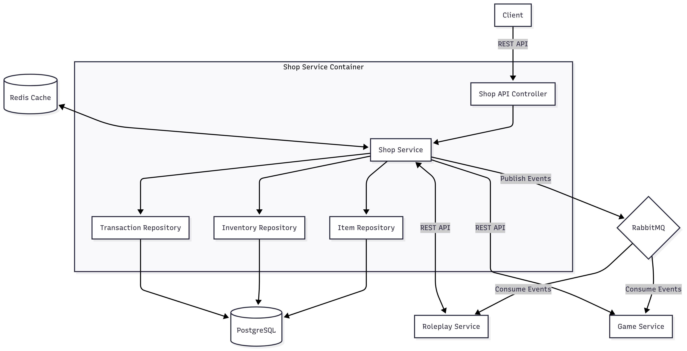
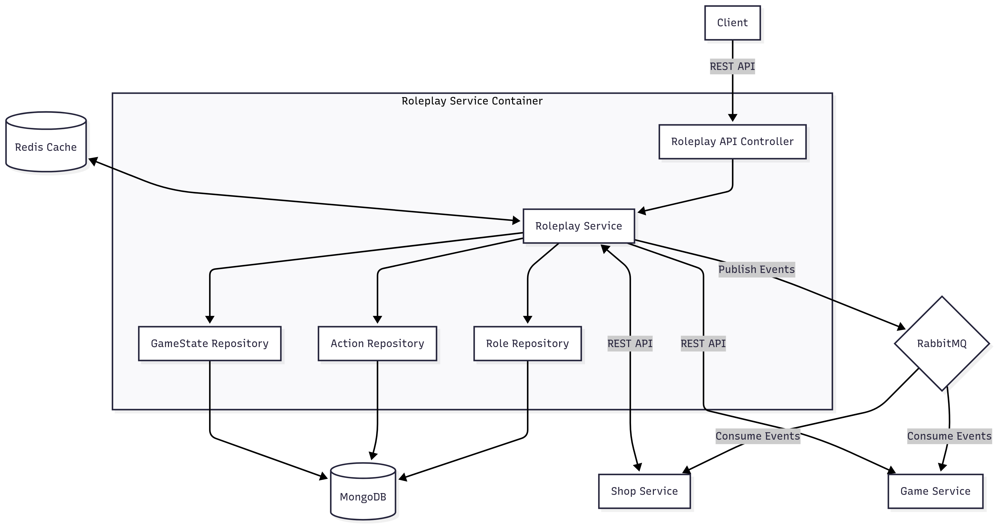
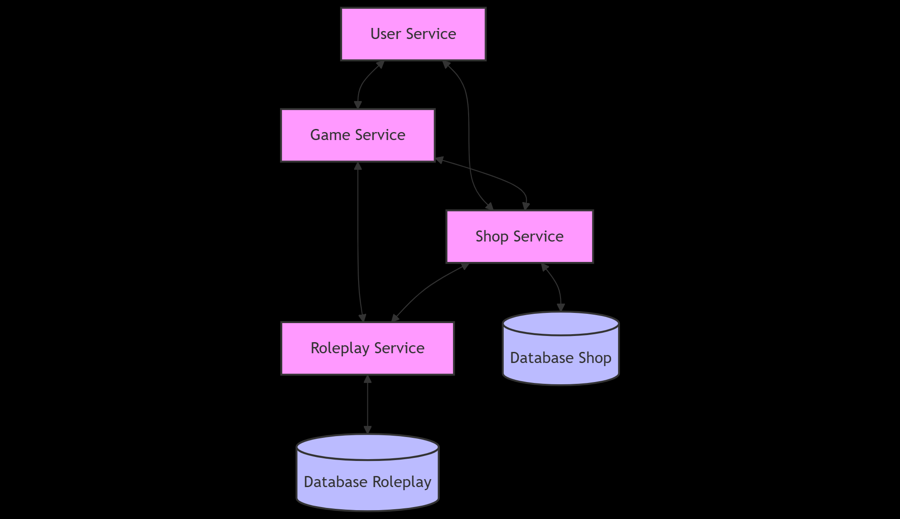

# Distributed Applications Labs - Mafia Platform

## Service Architecture Overview

The Mafia Platform is built using a microservices architecture, with each service encapsulating specific functionality to ensure modularity and independence. The platform enables users to play a game of Mafia with customized rules.

### Service Boundaries

1. **Shop Service (Java)**
   - Manages in-game currency and item purchases
   - Controls inventory and item availability
   - Implements dynamic pricing and daily quantity balancing algorithms
   - Maintains purchase history and item effects

2. **Roleplay Service (Java)**
   - Manages player roles and their specific abilities
   - Processes role-based actions (e.g., Mafia murders, Sheriff investigations)
   - Records all action attempts for game history
   - Creates filtered announcements for the Game Service to broadcast
   - Applies item effects on actions (immunity, protection)

## Shop Service

### Core responsibility: 
Handle all in-game economy operations including managing items inventory, processing purchases, and balancing daily item quantities. The service provides a mechanism for players to buy protective items and special abilities using in-game currency.

### Tech stack
- **Framework/language**: Spring Boot with Java 17 for robust transaction management and strong typing
- **Database**: PostgreSQL for reliable transaction support and data integrity
- **Other**: RabbitMQ for event messaging, Redis for caching frequently accessed items
- **Communication pattern**: REST API endpoints for synchronous operations and RabbitMQ for asynchronous event publishing. Uses Spring Data JPA for database operations.

### Shop Service Diagram



### Schema
The models used by the Shop Service represent game items, inventory management, and transaction records:

```java
interface Item {
    String getId();
    String getName();
    String getDescription();
    int getPrice();
    int getQuantityAvailable();
    Effect getEffect();
    void decreaseQuantity(int amount);
    boolean isAvailable(int requestedQuantity);
}

interface Inventory {
    String getUserId();
    List<InventoryItem> getItems();
    void addItem(Item item, int quantity);
    boolean useItem(String itemId);
    int getItemCount(String itemId);
}

interface Transaction {
    String getId();
    String getUserId();
    String getItemId();
    int getQuantity();
    int getTotalPrice();
    LocalDateTime getTimestamp();
    boolean isSuccessful();
}

interface Effect {
    String getType(); // PROTECTION, ATTACK, INVESTIGATION
    int getValue();
    int getDuration();
}
```

### Endpoints

#### GET /api/shop/items - Retrieve all available shop items

**Response:**
```json
{
  "items": [
    {
      "id": "garlic-123",
      "name": "Garlic",
      "description": "Protects against vampire attacks",
      "price": 50,
      "quantity_available": 10,
      "effect": {
        "type": "PROTECTION",
        "value": 100,
        "duration": 1
      }
    }
  ]
}
```

#### GET /api/shop/items/{id} - Retrieve specific item details
**Path Params:**
- id: string - ID of the item to retrieve

**Response:**
Item object as shown above

#### POST /api/shop/purchase - Purchase items
**Request Body Schema:**
```json
{
  "userId": "user-456",
  "itemId": "garlic-123",
  "quantity": 2
}
```

**Response:**
```json
{
  "success": true,
  "message": "Purchase successful",
  "transaction": {
    "id": "trans-789",
    "userId": "user-456",
    "itemId": "garlic-123",
    "quantity": 2,
    "totalPrice": 100,
    "timestamp": "2023-10-25T15:30:45Z"
  }
}
```

#### GET /api/shop/inventory/{userId} - Get user's inventory
**Path Params:**
- userId: string - ID of the user whose inventory to retrieve

**Response:**
```json
{
  "userId": "user-456",
  "items": [
    {
      "id": "garlic-123",
      "name": "Garlic",
      "quantity": 2,
      "effects": {
        "type": "PROTECTION",
        "value": 100,
        "duration": 1
      }
    }
  ]
}
```

#### POST /api/shop/use-item - Use an item from inventory
**Request Body Schema:**
```json
{
  "userId": "user-456",
  "itemId": "garlic-123",
  "targetId": "user-789" 
}
```

**Response:**
```json
{
  "success": true,
  "message": "Item used successfully",
  "effect": {
    "type": "PROTECTION",
    "value": 100,
    "applied_to": "user-789",
    "expires_at": "2023-10-26T15:30:45Z"
  }
}
```

### Dependencies
- PostgreSQL Database Container
- RabbitMQ for event messaging
- Redis for caching (optional)
- Game Service for currency validation
- Roleplay Service for applying item effects

## Roleplay Service

### Core responsibility: 
Manage game roles and their associated abilities, process role-based actions during day and night cycles, validate action permissions, and create filtered announcements for the Game Service to broadcast.

### Tech stack
- **Framework/language**: Spring Boot with Java 17 for consistent service implementation
- **Database**: MongoDB for flexible document structure to handle various role types and action records
- **Other**: RabbitMQ for event messaging, Redis for caching active roles
- **Communication pattern**: REST API endpoints for synchronous operations, RabbitMQ for publishing role action events and consuming shop events. Uses Spring Data MongoDB for database operations.

### Roleplay Service Diagram



### Schema
The models used by the Roleplay Service represent player roles, actions, and game state:

```java
interface Role {
    String getId();
    String getName();
    List<Ability> getAbilities();
    boolean canPerformAction(String actionType, GameState gameState);
    boolean hasImmunity(String attackType);
}

interface Ability {
    String getId();
    String getName();
    String getActionType();
    GamePhase getPhase(); // DAY, NIGHT
    int getCooldown();
    boolean canTargetSelf();
    boolean canTargetDead();
}

interface Action {
    String getId();
    String getUserId();
    String getTargetId();
    String getActionType();
    LocalDateTime getTimestamp();
    GamePhase getPhase();
    boolean isSuccessful();
    String getOutcomeMessage();
    List<String> getEffectsApplied();
}

interface GameState {
    String getGameId();
    GamePhase getCurrentPhase();
    int getCurrentDay();
    List<String> getAlivePlayerIds();
    List<String> getDeadPlayerIds();
    Map<String, Role> getPlayerRoles();
}

enum GamePhase {
    DAY, NIGHT, DISCUSSION, VOTING
}
```

### Endpoints

#### POST /api/roleplay/action - Perform a role action
**Request Body Schema:**
```json
{
  "userId": "player-123",
  "actionType": "KILL",
  "targetId": "player-456",
  "useItems": [
    {"itemId": "knife-789"}
  ],
  "gameId": "game-001"
}
```

**Response:**
```json
{
  "success": true,
  "message": "Action executed successfully",
  "actionResult": {
    "actionId": "action-123",
    "outcome": "TARGET_KILLED",
    "effectsApplied": ["DEATH"],
    "announcement": "A player has died during the night."
  }
}
```

#### GET /api/roleplay/role/{userId} - Get player's role
**Path Params:**
- userId: string - ID of the player

**Query Params:**
- gameId: string - ID of the game

**Response:**
```json
{
  "userId": "player-123",
  "role": "MAFIA",
  "abilities": [
    {
      "id": "ability-kill",
      "name": "Kill",
      "actionType": "KILL",
      "phase": "NIGHT",
      "cooldown": 0,
      "canTargetSelf": false,
      "canTargetDead": false
    }
  ],
  "isAlive": true
}
```

#### GET /api/roleplay/history/{gameId} - Get game action history
**Path Params:**
- gameId: string - ID of the game

**Response:**
```json
{
  "gameId": "game-001",
  "actions": [
    {
      "actionId": "action-123",
      "userId": "player-123",
      "actionType": "KILL",
      "targetId": "player-456",
      "outcome": "TARGET_KILLED",
      "timestamp": "2023-10-25T03:15:22Z",
      "phase": "NIGHT",
      "day": 1
    }
  ]
}
```

#### POST /api/roleplay/game - Create a new game with roles
**Request Body Schema:**
```json
{
  "gameId": "game-002",
  "players": [
    {"userId": "player-123", "role": "MAFIA"},
    {"userId": "player-456", "role": "CIVILIAN"},
    {"userId": "player-789", "role": "SHERIFF"}
  ]
}
```

**Response:**
```json
{
  "success": true,
  "message": "Game created successfully",
  "gameState": {
    "gameId": "game-002",
    "phase": "NIGHT",
    "day": 1,
    "alivePlayers": ["player-123", "player-456", "player-789"],
    "deadPlayers": []
  }
}
```

#### PUT /api/roleplay/game/{gameId}/phase - Update game phase
**Path Params:**
- gameId: string - ID of the game

**Request Body Schema:**
```json
{
  "phase": "DAY",
  "day": 2
}
```

**Response:**
```json
{
  "success": true,
  "message": "Game phase updated",
  "gameState": {
    "gameId": "game-002",
    "phase": "DAY",
    "day": 2,
    "alivePlayers": ["player-123", "player-456"],
    "deadPlayers": ["player-789"]
  }
}
```

### Dependencies
- MongoDB Database Container
- RabbitMQ for event messaging
- Redis for caching (optional)
- Shop Service for item effect application
- Game Service for game state updates and announcements

## Architecture Diagram



## Technologies and Communication Patterns

### Shop Service
- **Language**: Java
- **Framework**: Spring Boot
- **Database**: PostgreSQL
- **Communication**: REST API, Event-based messaging with RabbitMQ
- **Justification**: Java with Spring Boot provides robust transaction management necessary for currency operations and inventory control. PostgreSQL offers reliable transaction support and data integrity for financial operations.

### Roleplay Service
- **Language**: Java
- **Framework**: Spring Boot
- **Database**: MongoDB
- **Communication**: REST API, Event-based messaging with RabbitMQ
- **Justification**: Java is used for consistent development experience across our team's services. MongoDB's document-oriented structure is ideal for storing varied role configurations and action records with different structures based on role types.

### Communication Pattern
- **Synchronous**: REST APIs for direct service-to-service communication
- **Asynchronous**: Event-driven architecture using RabbitMQ for notifications and state changes
- **Justification**: The combination allows for immediate responses when required (synchronous) while enabling loose coupling for event notifications like role action outcomes (asynchronous).

## Communication Contracts

### Shop Service API

#### 1. Get Available Items
- **Endpoint**: `GET /api/shop/items`
- **Description**: Retrieves all available items in the shop
- **Response**:
```json
{
  "items": [
    {
      "id": "string",
      "name": "string",
      "description": "string",
      "price": "number",
      "quantity": "number",
      "effects": {
        "type": "string",
        "value": "number"
      }
    }
  ]
}
```

#### 2. Purchase Item
- **Endpoint**: `POST /api/shop/purchase`
- **Description**: Purchase an item from the shop
- **Request**:
```json
{
  "userId": "string",
  "itemId": "string",
  "quantity": "number"
}
```
- **Response**:
```json
{
  "success": "boolean",
  "message": "string",
  "transaction": {
    "id": "string",
    "userId": "string",
    "itemId": "string",
    "quantity": "number",
    "totalPrice": "number",
    "timestamp": "string"
  }
}
```

#### 3. Get User Inventory
- **Endpoint**: `GET /api/shop/inventory/{userId}`
- **Description**: Get a user's inventory of purchased items
- **Response**:
```json
{
  "userId": "string",
  "items": [
    {
      "id": "string",
      "name": "string",
      "quantity": "number",
      "effects": {
        "type": "string",
        "value": "number"
      }
    }
  ]
}
```

### Roleplay Service API

#### 1. Perform Role Action
- **Endpoint**: `POST /api/roleplay/action`
- **Description**: Perform a role-specific action
- **Request**:
```json
{
  "userId": "string",
  "actionType": "string",
  "targetId": "string",
  "useItems": [
    {
      "itemId": "string"
    }
  ]
}
```
- **Response**:
```json
{
  "success": "boolean",
  "message": "string",
  "actionResult": {
    "actionId": "string",
    "outcome": "string",
    "effectsApplied": ["string"],
    "announcement": "string"
  }
}
```

#### 2. Get Player Role
- **Endpoint**: `GET /api/roleplay/role/{userId}`
- **Description**: Get a player's assigned role
- **Response**:
```json
{
  "userId": "string",
  "role": "string",
  "abilities": ["string"],
  "isAlive": "boolean"
}
```

#### 3. Get Action History
- **Endpoint**: `GET /api/roleplay/history/{gameId}`
- **Description**: Get history of actions for a specific game
- **Response**:
```json
{
  "gameId": "string",
  "actions": [
    {
      "actionId": "string",
      "userId": "string",
      "actionType": "string",
      "targetId": "string",
      "outcome": "string",
      "timestamp": "string"
    }
  ]
}
```

## Data Management

- Each service maintains its own database to ensure loose coupling
- Shop Service uses PostgreSQL for transactional integrity on purchases and inventory
- Roleplay Service uses MongoDB for flexible document structure to accommodate different role types and actions
- Services communicate through well-defined APIs rather than direct database access
- Event-based communication ensures eventual consistency across services

## Team Responsibilities

- **Shop Service**: [Ceban Vasile]
- **Roleplay Service**: [Ceban Vasile]