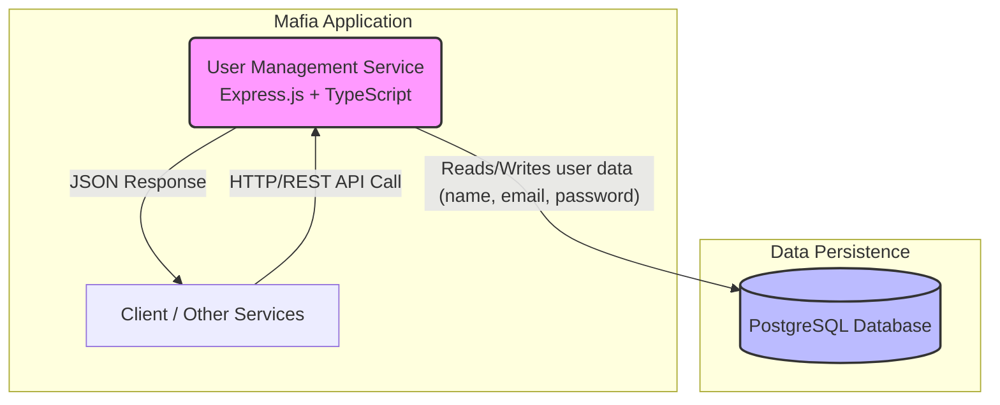
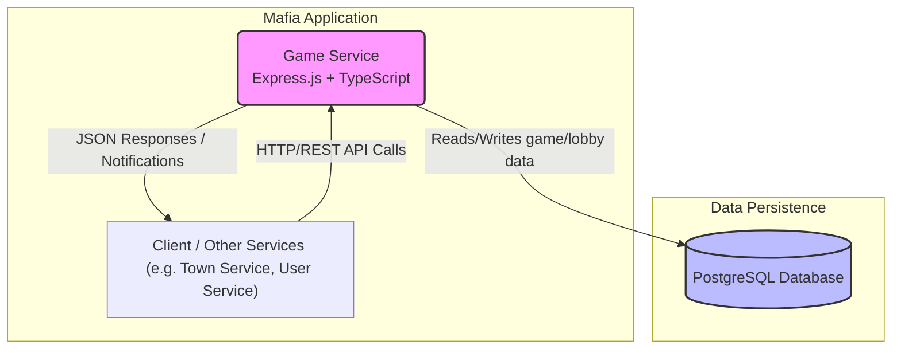
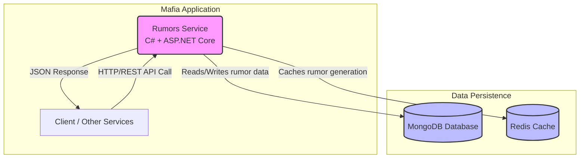
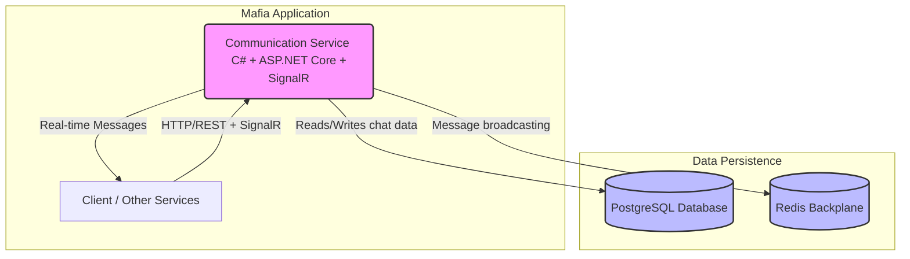

# distributed_applications_labs

## User Management Service

* **Core responsibility:** Single user profile (email, username, hashed password) + in‑game currency balance.
* Track simple profiling info: device fingerprints and last known IP/location to discourage duplicate accounts.
* Keep it minimal; no government/passport style identification.

### Tech stack

* **Framework/language:** Express.js + TypeScript (fast iteration, typing)
* **Database:** PostgreSQL (transactions for currency updates)
* **Other:** Password hashing library (argon2/bcrypt)
* **Communication pattern:** Internal REST API + direct DB persistence

### Service Diagram



### Schema

Minimal types only.

```typescript
interface User {
    id: string;
    email: string;        // unique
    username: string;     // unique
    passwordHash: string; // not exposed
    currency: number;     // float
    transactions: CurrencyTransaction[];
    lastIp?: string;
    lastCountry?: string;
    devices: Device[];
    updatedAt: string;
    createdAt: string;
}

enum DevicePlatform {
    WEB,
    ANDROID,
    IOS,
    DESKTOP
}

interface Device {
    id: string;
    userId: string;
    fingerprint: string;  // stable hash
    platform: DevicePlatform;
    lastSeenAt: string;
}

enum TransactionType {
    ADD,
    SUBTRACT
}

interface CurrencyTransaction {
    id: string;
    userId: string;
    transactionType: TransactionType; 
    resultingBalance: number; // after apply
    createdAt: string;
}
```

### Endpoints

Minimal set for MVP.

#### `GET v1/users/{id}` – Retrieve user by ID

Returns a user DAO

```typescript
interface UserDao {
    id: string;
    email: string;
    username: string;
    currency: number;
    lastCountry?: string;
    updatedAt: string;
    createdAt: string;
}
```

#### `GET v1/users` - List method with optional filters

**Query Params:**

* `username` - string, query by username
* `email` - string, query by email

#### `POST v1/users` – Create user

Body:

```json
{
    "email": "user@example.com",
    "username": "playerOne",
    "password": "PlainPassword!", // hash on the server
    "initialDevice": { "fingerprint": "sha256:abcd...", "platform": "web" },
    "initialLocation": { "country": "DE" }
}
```

Responses: 201 | 409 (email/username in use).

#### `POST v1/users/{id}/devices` – Register device

Body:

```json
{ "fingerprint": "sha256:abcd...", "platform": "web" }
```

Same fingerprint updates timestamp.

#### `GET v1/users/{id}/devices` – List devices

Returns array of device metadata.

#### `POST v1/users/{id}/currency` - Add a transaction to the user

Body:

```json
{ "amount": 500, "reason": "REWARD", "type":"ADD" }
```

#### `GET v1/users/{id}/currency/transactions` – History

### Dependencies

* PostgreSQL DB Container
* Password hashing lib (argon2/bcrypt)
* (Optional later) Message broker for events

## Game service

* **Core responsibility:** Main gameplay logic. Should handle lobbies of up to 30 players, track player state (alive/dead, role, career) and orchestrate the Day/Night cycle.
Should send notifications about events/announcements (kill, heal, rumor, visit, exile).
Initiates and manages the voting process before announcing exiles.

### Tech stack

* **Framework/language:** Express.js + TypeScript (consistent with other services and fast prototyping)
* **Databse:** PostgreSQL (data persistence, versatile DB)
* **Other:** Event/Notification mechanism via REST and WebSockets (consider upgrade to message brokers).
* **Communication pattern:** Internal REST API

### Service Diagram



### Schema

describe participating models and their schemas e.g.

```typescript
interface Lobby {
    id: string;
    name: string;
    players: Player[];
    dayNightCycle: CycleState;
    createdAt: string;
    updatedAt: string;
}

interface Player {
    id: string;
    userId: string;    // link to User Service
    lobbyId: string;
    role: Role;
    career: Career;
    isAlive: boolean;
    joinedAt: string;
}

enum Role {
    MAFIA,
    DOCTOR,
    DETECTIVE,
    VILLAGER
    // extendable
}

enum Career {
    LAWYER,
    JOURNALIST,
    MERCHANT,
    SOLDIER
    // flavor / abilities in future
}

enum CycleState {
    DAY,
    NIGHT
}

interface GameEvent {
    id: string;
    lobbyId: string;
    type: EventType;
    description: string;
    createdAt: string;
}

enum EventType {
    KILL,
    HEAL,
    RUMOR,
    VISIT,
    EXILE,
    ANNOUNCEMENT
}

interface Vote {
    id: string;
    lobbyId: string;
    voterPlayerId: string;
    targetPlayerId?: string; // optional (abstain)
    createdAt: string;
}
```

### Endpoints

#### `POST v1/lobbies` – Create new lobby

Request body

```json
{ "name": "Lobby 1" }
```

#### `POST v1/lobbies/{id}/join` – Add player to lobby

Body:

```json
{ "userId": "uuid-of-user", "role": "VILLAGER", "career": "MERCHANT" }
```

Response: Player object.
Errors: 409 (lobby full or already joined).

#### `GET v1/lobbies/{id}` – Retrieve lobby state

### Dependencies

* PostgreSQL DB container
* Express.js + TypeScript runtime
* (Optional later) Message broker for real-time announcements (e.g. Kafka, RabbitMQ, or WebSocket layer)

## Rumors Service

* **Core responsibility:** Currency-based information marketplace allowing players to purchase intelligence about other players based on their tasks and appearance data. Track information availability by role restrictions and generate rumors from Task Service and Character Service data.

### Tech stack

* **Framework/language:** C# + ASP.NET Core Web API (enterprise-grade reliability for financial transactions, strong typing for currency operations, excellent performance for microservices)
* **Database:** MongoDB (flexible document storage for varied rumor data structures, easy schema evolution)
* **Other:** MongoDB.Driver for C#, Redis for caching expensive rumor generation, JWT Bearer authentication
* **Communication pattern:** REST API with other services, async processing for rumor generation

### Service Diagram



### Schema

```csharp
public class Rumor
{
    public string Id { get; set; }
    public string BuyerId { get; set; }
    public string TargetPlayerId { get; set; }
    public string InformationType { get; set; } // "TASK", "APPEARANCE", "INVENTORY"
    public string Content { get; set; }
    public double Accuracy { get; set; } // 0.0 to 1.0
    public int Cost { get; set; }
    public List<string> AvailableToRoles { get; set; }
    public DateTime PurchasedAt { get; set; }
}

public class RumorTemplate
{
    public string Id { get; set; }
    public string Template { get; set; } // "Player {name} was seen {action}"
    public string SourceService { get; set; }
    public List<string> RoleRestrictions { get; set; }
    public int BaseCost { get; set; }
}
```

### Endpoints

#### `POST v1/rumors/purchase` – Buy a rumor with currency

Body:
```json
{
    "targetPlayerId": "uuid-of-target",
    "informationType": "TASK"
}
```

#### `GET v1/rumors/available` – Get available rumors for user's role

Returns array of available rumor types for the current user's role.

#### `GET v1/rumors/pricing` – Get current rumor costs

Returns pricing information for different rumor types.

#### `GET v1/rumors/history/{userId}` – Get purchase history

Returns user's rumor purchase history.

### Dependencies

* MongoDB container
* Redis container  
* .NET 8 runtime
* Integration with User Management Service (currency deduction)
* Integration with Task Service (task data)
* Integration with Character Service (appearance data)

## Communication Service

* **Core responsibility:** Multi-channel chat system with game-state-aware messaging rules. Global chat during voting hours, private Mafia channels, location-based messaging.

### Tech stack

* **Framework/language:** C# + ASP.NET Core Web API with SignalR (excellent WebSocket support, real-time messaging capabilities, enterprise reliability)
* **Database:** PostgreSQL (ACID compliance for chat history, consistent with other services)
* **Other:** SignalR for real-time messaging, Redis for message broadcasting and scaling, Npgsql for PostgreSQL connectivity
* **Communication pattern:** REST + SignalR APIs, event-driven messaging

### Service Diagram



### Schema

```csharp
public class ChatMessage
{
    public string Id { get; set; }
    public string SenderId { get; set; }
    public string ChannelId { get; set; }
    public string Content { get; set; }
    public string Type { get; set; } // "GLOBAL", "MAFIA", "LOCATION"
    public DateTime Timestamp { get; set; }
}

public class ChatChannel
{
    public string Id { get; set; }
    public string Type { get; set; }
    public string Name { get; set; }
    public string LocationId { get; set; } // optional for location-based chats
    public List<string> Participants { get; set; }
    public bool IsActive { get; set; }
}
```

### Endpoints

#### `POST v1/chat/global/messages` – Send global message (voting hours only)

Body:
```json
{
    "content": "I think player X is suspicious"
}
```

#### `GET v1/chat/global/messages` – Get global chat history

Returns array of global chat messages.

#### `POST v1/chat/mafia/messages` – Send Mafia private message

Body:
```json
{
    "content": "Let's target player Y tonight"
}
```

#### `GET v1/chat/channels/{channelId}/messages` – Get channel messages

Returns messages for specific channel.

#### SignalR Hub: `/chathub` – Real-time messaging connection

SignalR hub for real-time message delivery and channel management.

### Dependencies

* PostgreSQL DB container
* Redis container
* .NET 8 runtime
* SignalR support
* Integration with Game Service (voting hours, game state)
* Integration with User Management Service (user roles, authentication)