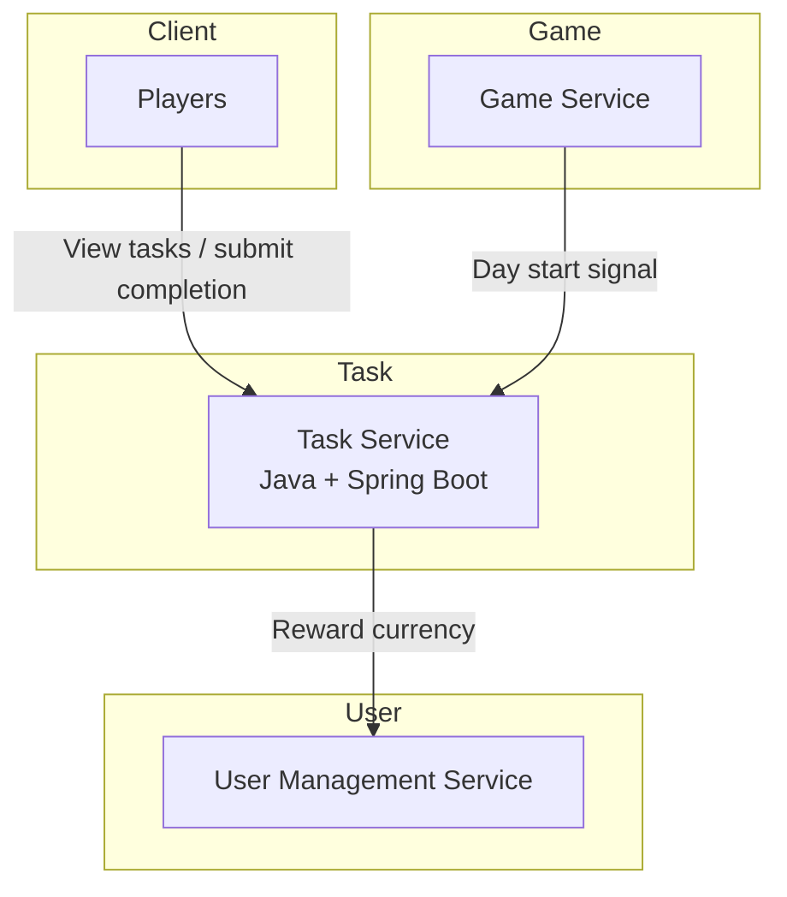

# distributed_applications_labs

## Task Service

* **Core responsibility:** Assign daily tasks at the start of the day based on each player’s role and career. Track completion of those tasks, reward in-game currency, and optionally generate rumors that influence the game narrative.

### Tech stack

* **Framework/language:** Java + Spring Boot (strong ecosystem, great support for REST APIs, built-in validation/security features).  
* **Database:** PostgreSQL (transactional safety for task assignment and reward crediting).  
* **Other:** Spring Data JPA (ORM), Spring Security (for authentication/authorization), Jackson (JSON serialization).  
* **Communication pattern:** REST API (JSON over HTTP) between services. Optionally event publishing (e.g., `rumor.created`) to a message broker in future extensions.

### Service Diagram


### Schema
```java
enum TaskStatus {
    ASSIGNED,
    COMPLETED,
    FAILED
}

class TaskDefinition {
    UUID id;
    String role;            // role/career that receives this task
    String description;     
    String requirementType; // e.g., VISIT, USE_ITEM, INTERACT
}

class DailyTaskAssignment {
    UUID id;
    UUID userId;
    UUID taskDefinitionId;
    TaskStatus status;
    LocalDateTime createdAt;
    LocalDateTime completedAt;
}

class TaskEvent {
    UUID id;
    UUID assignmentId;
    String eventType;   // e.g., COMPLETION, FAILURE, RUMOR
    LocalDateTime createdAt;
}
```

## Endpoints
`POST v1/tasks/day/start` – Assign tasks for all players
Request
```json
{ "day": 12 }
```
Response 200
```json
{ "day": 12, "assignedTasks": 120 }
```
Errors
```json
{ "error": { "code": "DAY_ALREADY_STARTED", "message": "Day already processed" } }
```
`GET v1/tasks/{userId}` – Retrieve tasks for a player
Path Params:
- `userId: string (uuid)`
Response 200
```json
[
  { "id": "uuid", "description": "Visit hospital", "status": "ASSIGNED" }
]
```
Errors
```json
{ "error": { "code": "NOT_FOUND", "message": "User not found" } }
```

`POST v1/tasks/{assignmentId}/complete` – Mark task as complete

Headers: `Idempotency-Key: string` (recommended)
Path Params:
- `assignmentId: string (uuid)`
Response 200
```json
{ "status": "COMPLETED", "reward": { "currency": 50 } }
```
Errors
```json
{ "error": { "code": "INVALID_STATE", "message": "Task already completed" } }
```
## Dependencies
- Game Service: sends /day/start signal.
- User Management Service: credits currency on completion.
- Optional Shop/Roleplay: validates item/location/role requirements.

## Data ownership:
This service exclusively manages `task_definitions`, `daily_task_assignments`, and `task_events`. No other service writes to this DB.
