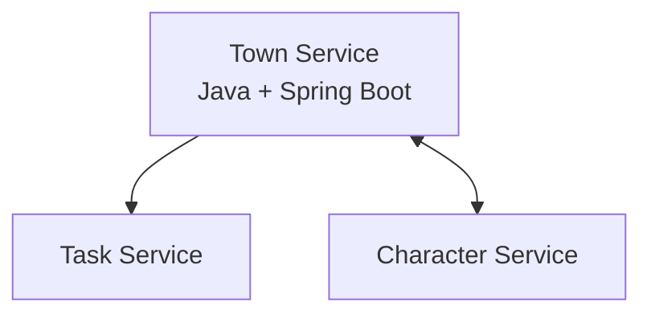

# Game Services Architecture

## Town Service

### Core Responsibility
Manages game world locations, tracks player movement, and enforces location-based access control.

### Tech Stack
- **Framework/Language:** Java 17 + Spring Boot 3.2 (WebFlux) – chosen for high concurrency handling and real-time movement tracking
- **Database:** PostgreSQL with spatial extensions – for coordinate-based queries and efficient location management
- **Other:** Docker for containerization, Gradle 8.0+ for builds, Git for version control

### Communication Pattern
- **Synchronous:** REST APIs for location validation and movement recording
- **Asynchronous:** Event publishing for movement notifications
- **Real-time:** WebSockets for live updates of player positions

### Service Diagram


### Schema
```typescript
interface Location {
    id: string;
    name: string;
    type: "SHOP" | "SAFE_HOUSE" | "PUBLIC_AREA";
    accessRules: AccessRule[];
    coordinates: { x: number, y: number };
}

interface PlayerMovement {
    userId: string;
    gameId: string;
    toLocationId: string;
    timestamp: string;
    purpose: "TASK" | "SHOPPING" | "INVESTIGATION";
}
```

### Endpoints

#### `GET v1/locations`
Retrieve available locations
- **Query Params:** (none)

#### `POST v1/movements`
Record player movement
- **Request Body:**
```json
{
  "userId": "user_123",
  "gameId": "game_456",
  "toLocationId": "loc_002",
  "purpose": "TASK"
}
```

#### `GET v1/movements/{userId}/history`
Retrieve movement history
- **Path Params:**
  1. `userId: string` – ID of the user
- **Query Params:**
  1. `gameId: string`
  2. `limit: number`
  3. `startDate: string`

### Dependencies
- **Character Service** – for validating access to restricted locations
- **Task Service** – for integrating movement with game tasks and objectives