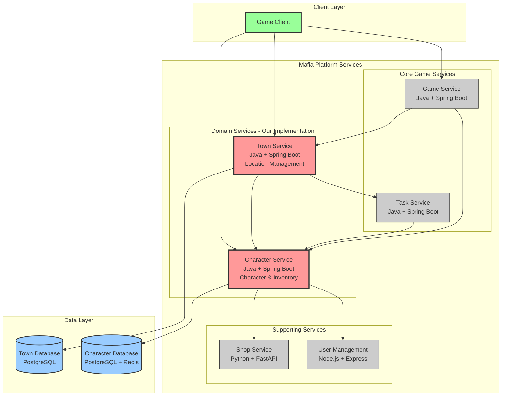
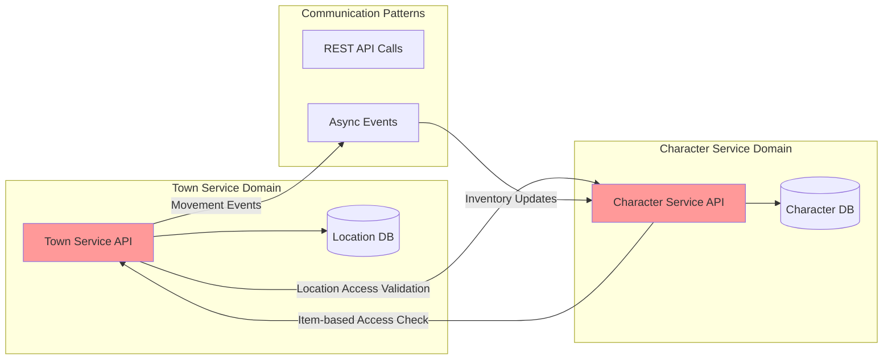
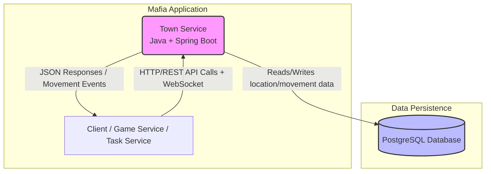
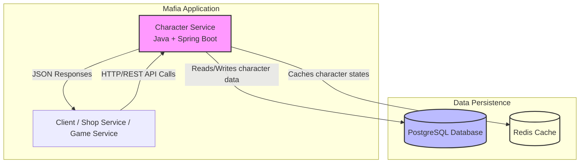

# distributed_applications_labs

## Service Boundaries Overview

### Town Service & Character Service Communication Architecture



### Focused Communication: Town ↔ Character Services



---

## Town Service
* **Core responsibility:** Manages all game world locations and tracks player movement patterns within the town.

**Functionality**:
- Location registry management (Shop, Informator Bureau, safe houses, etc.)
- Real-time player movement tracking between locations
- Location access control and restrictions enforcement
- Activity reporting to Task Service for task validation
- Location-based event triggers and interactions
- Movement history and analytics

### Tech stack
* **Framework/language:** Java + Spring Boot (robust concurrency for real-time tracking, excellent ecosystem)
* **Database:** PostgreSQL (spatial data support for locations, transaction safety for movement logs)
* **Other:** WebSocket support via Spring WebSocket, Spring Data JPA, Jackson for JSON
* **Communication pattern:** REST API + WebSocket for real-time updates + Event publishing

### Service Diagram


### Schema
```typescript
interface Location {
    id: string;
    name: string;
    type: LocationType;
    description: string;
    accessRules: AccessRule[];
    capacity?: number;
    coordinates: { x: number, y: number };
    isActive: boolean;
    createdAt: string;
}

enum LocationType {
    SHOP,
    INFORMATOR_BUREAU,
    SAFE_HOUSE,
    PUBLIC_AREA,
    RESTRICTED_ZONE
}

interface AccessRule {
    requirement: string;  // ROLE, ITEM, TIME_WINDOW
    value: string;
    allowed: boolean;
}

interface PlayerMovement {
    id: string;
    userId: string;
    gameId: string;
    fromLocationId?: string;
    toLocationId: string;
    timestamp: string;
    duration?: number;  // time spent at location
    purpose?: string;   // TASK, SHOPPING, INVESTIGATION
}

interface LocationActivity {
    id: string;
    locationId: string;
    userId: string;
    activityType: ActivityType;
    metadata: Record<string, any>;
    reportedToTaskService: boolean;
    timestamp: string;
}

enum ActivityType {
    VISIT,
    PURCHASE,
    INVESTIGATION,
    MEETING,
    TASK_COMPLETION
}
```

### Endpoints

#### `GET v1/locations` – Get all available locations
Response 200:
```json
{
  "locations": [
    {
      "id": "uuid",
      "name": "Central Shop",
      "type": "SHOP",
      "description": "Main shopping area",
      "accessRules": [],
      "capacity": 50,
      "coordinates": { "x": 10, "y": 20 },
      "isActive": true
    }
  ]
}
```

#### `POST v1/movements` – Record player movement
Request:
```json
{
  "userId": "uuid",
  "gameId": "uuid", 
  "toLocationId": "uuid",
  "purpose": "TASK"
}
```

Response 201:
```json
{
  "movementId": "uuid",
  "fromLocation": "Previous Location",
  "toLocation": "New Location", 
  "timestamp": "2025-09-08T10:00:00Z",
  "accessGranted": true
}
```

#### `GET v1/movements/{userId}/history` – Get movement history
Query params: `gameId`, `limit`, `offset`

Response 200:
```json
{
  "movements": [
    {
      "locationName": "Central Shop",
      "timestamp": "2025-09-08T10:00:00Z",
      "duration": 300,
      "purpose": "SHOPPING"
    }
  ]
}
```

### Dependencies
* Task Service: reports activities for task validation
* Game Service: receives location-based events
* Character Service: validates location access based on inventory

---

## Character Service
* **Core responsibility:** Manages player character customization and inventory system.

**Functionality**:
- Character appearance customization system
- Inventory management for purchased and earned items
- Asset catalog management (clothing, accessories, tools)
- Slot-based customization system (hair, coat, accessories)
- Character state persistence and synchronization
- Item effect tracking for gameplay mechanics

### Tech stack
* **Framework/language:** Java + Spring Boot (consistent enterprise-grade architecture, excellent ORM support)
* **Database:** PostgreSQL (JSON support for flexible customization data, ACID properties for inventory consistency)
* **Other:** Redis for caching character states, Jackson for JSON processing, Spring Data JPA
* **Communication pattern:** REST API + Event publishing for inventory changes

### Service Diagram


### Schema
```typescript
interface Character {
    id: string;
    userId: string;
    gameId: string;
    appearance: CharacterAppearance;
    inventory: InventoryItem[];
    customizationSlots: CustomizationSlot[];
    lastUpdated: string;
    createdAt: string;
}

interface CharacterAppearance {
    skinTone: string;
    hairStyle: string;
    hairColor: string;
    eyeColor: string;
    clothing: ClothingSet;
    accessories: string[];
}

interface ClothingSet {
    hat?: string;
    shirt: string;
    pants: string;
    shoes: string;
    coat?: string;
}

interface InventoryItem {
    id: string;
    assetId: string;
    name: string;
    category: AssetCategory;
    quantity: number;
    acquiredFrom: 'SHOP' | 'REWARD' | 'TASK';
    effects: ItemEffect[];
    isEquipped: boolean;
    acquiredAt: string;
}

interface CustomizationSlot {
    slotType: SlotType;
    equippedAssetId?: string;
    restrictions: string[];  // role, level, or item requirements
}

enum SlotType {
    HAIR,
    HAT,
    SHIRT,
    PANTS, 
    SHOES,
    COAT,
    ACCESSORY_1,
    ACCESSORY_2,
    TOOL
}

enum AssetCategory {
    HAIR,
    CLOTHING,
    ACCESSORY,
    TOOL,
    CONSUMABLE
}

interface Asset {
    id: string;
    name: string;
    description: string;
    category: AssetCategory;
    imageUrl: string;
    rarity: 'COMMON' | 'RARE' | 'LEGENDARY';
    requirements: AssetRequirement[];
    effects: ItemEffect[];
}

interface AssetRequirement {
    type: 'ROLE' | 'LEVEL' | 'ITEM';
    value: string;
}

interface ItemEffect {
    type: 'STEALTH' | 'CHARISMA' | 'PROTECTION' | 'SPEED';
    value: number;
    duration?: number;
}
```

### Endpoints

#### `GET v1/characters/{userId}` – Get character data
Query params: `gameId`

Response 200:
```json
{
  "id": "uuid",
  "userId": "uuid", 
  "appearance": {
    "skinTone": "light",
    "hairStyle": "short",
    "hairColor": "brown",
    "clothing": {
      "shirt": "casual-blue",
      "pants": "jeans",
      "shoes": "sneakers"
    }
  },
  "inventory": [
    {
      "id": "uuid",
      "name": "Leather Coat",
      "category": "CLOTHING",
      "quantity": 1,
      "isEquipped": false,
      "effects": [
        {
          "type": "PROTECTION",
          "value": 10
        }
      ]
    }
  ]
}
```

#### `PUT v1/characters/{userId}/customize` – Update character appearance
Request:
```json
{
  "gameId": "uuid",
  "changes": {
    "hairStyle": "long",
    "equippedItems": {
      "COAT": "leather-coat-001"
    }
  }
}
```

Response 200:
```json
{
  "success": true,
  "character": {
    "appearance": { /* updated appearance */ },
    "activeEffects": [
      {
        "type": "PROTECTION",
        "value": 10,
        "source": "Leather Coat"
      }
    ]
  }
}
```

#### `GET v1/assets` – Get available customization assets
Query params: `category`, `rarity`, `availableOnly`

Response 200:
```json
{
  "assets": [
    {
      "id": "uuid",
      "name": "Fedora Hat",
      "category": "CLOTHING",
      "imageUrl": "https://assets.game/fedora.png",
      "rarity": "RARE",
      "requirements": [
        {
          "type": "ROLE",
          "value": "DETECTIVE"
        }
      ]
    }
  ]
}
```

#### `POST v1/characters/{userId}/inventory/add` – Add item to inventory
Request:
```json
{
  "gameId": "uuid",
  "assetId": "uuid",
  "quantity": 1,
  "source": "SHOP"
}
```

Response 201:
```json
{
  "inventoryItemId": "uuid",
  "message": "Item added to inventory"
}
```

### Dependencies
* Shop Service: receives purchased items
* Town Service: validates location-based item usage
* Game Service: applies character effects to gameplay
* User Management Service: validates user ownership

## Data ownership:
- Town Service exclusively manages `locations`, `player_movements`, and `location_activities`
- Character Service exclusively manages `characters`, `assets`, `inventory_items`, and `customization_slots`