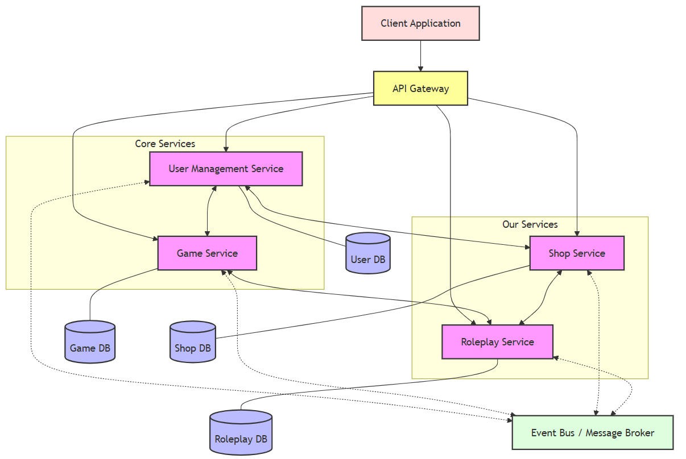

# Mafia Platform - Microservices Architecture

## Project Overview
The Mafia Platform is a distributed application that enables users to play a specialized version of the Mafia game with unique rules. The platform is built using a microservices architecture to ensure scalability, maintainability, and clear separation of concerns.

## Architecture Overview
The system is designed using microservices architecture where each service is responsible for a specific domain of the application. This approach allows for independent development, deployment, and scaling of services. The services communicate via APIs, enabling loose coupling between components.

### Architecture Diagram



### Service Communication Patterns

The diagram above illustrates the communication flows between services in our Mafia Platform:

1. **Synchronous Communication (Solid Lines)**
   - The Shop Service communicates directly with the User Management Service for account validation and currency operations
   - The Roleplay Service communicates with the Game Service to update game state based on role actions
   - The Shop Service and Roleplay Service have bidirectional communication to handle item effects on actions

2. **Asynchronous Communication (Dotted Lines)**
   - All services publish events to the Event Bus for asynchronous processing
   - The Game Service subscribes to Roleplay Service events to broadcast announcements
   - The Shop Service listens for game state changes to refresh daily items

3. **Database Isolation**
   - Each service maintains its own database
   - No direct cross-service database access is permitted
   - Data consistency is maintained through events and API calls

## Service Boundaries

### Core Services
3. **Shop Service** - Manages in-game economy, items, and purchases
4. **Roleplay Service** - Controls role-specific actions and game events

## Microservices

### Shop Service
**Responsibility**: Manages the in-game economy and item system

**Functionality**:
- Inventory management for in-game items
- Purchase processing using in-game currency
- Dynamic item availability (daily quantity balancing algorithm)
- Item effects management (e.g., protection attributes)
- Transaction history tracking
- Currency management

**Service Boundaries**:
- Owns all item-related data and operations
- Manages economic transactions
- Controls item availability algorithms

**APIs Exposed**:
- GET /items - List available items
- GET /items/{id} - Get item details
- POST /purchases - Process a purchase
- GET /inventory/{userId} - View user's inventory
- GET /balance/{userId} - Check user's currency balance
- PUT /balance/{userId} - Update user's balance

### Roleplay Service
**Responsibility**: Controls game mechanics related to player roles and actions

**Functionality**:
- Role assignment and management
- Processing role-specific actions (e.g., Mafia kills, Sheriff investigations)
- Checking item effectiveness during actions
- Recording all action attempts for audit purposes
- Creating filtered announcements for the Game Service to broadcast
- Enforcing role-specific rules and constraints

**Service Boundaries**:
- Owns all role-related logic and actions
- Controls the outcome of night/day activities
- Manages immunity and protection mechanisms
- Does NOT handle direct user communication

**APIs Exposed**:
- POST /actions - Perform a role-specific action
- GET /roles - Get available roles information
- GET /roles/{userId} - Get a user's role
- POST /announcements - Create filtered game announcements
- GET /actions/history - Get action history (admin only)
- GET /actions/results - Get results of actions for the current phase

## Data Management Strategy

Our microservices architecture adopts the **Database-per-Service** pattern, where each service owns and manages its dedicated database. This approach ensures:

1. **Service Autonomy**: Each service can independently evolve its data schema without affecting other services
2. **Scalability**: Databases can be scaled according to the specific needs of each service
3. **Technology Alignment**: Database technology can be selected to best suit each service's data requirements
4. **Isolation**: Failures or performance issues in one database don't impact other services

### Cross-Service Data Access

Data is never accessed directly across service boundaries. Instead, we employ:

1. **API-Based Access**: Services expose REST endpoints for synchronous data needs
2. **Event-Driven Updates**: Services publish events when their data changes
3. **Eventual Consistency**: Services maintain local projections of necessary external data
4. **Data Duplication**: Critical data may be duplicated across services for performance and availability

## Communication Contract

This section defines the comprehensive API contract for our services, specifying the endpoints, request/response formats, and data types for inter-service communication.

### Shop Service API Contract

#### 1. Get Available Items

**Endpoint:** `GET /api/v1/items`

**Description:** Retrieves all available items for purchase in the shop.

**Response Format:**
```json
{
  "items": [
    {
      "id": "string",
      "name": "string",
      "description": "string",
      "price": 0,
      "category": "string",
      "effects": [
        {
          "type": "string",
          "value": 0,
          "duration": 0
        }
      ],
      "availableQuantity": 0,
      "imageUrl": "string"
    }
  ],
  "totalItems": 0,
  "totalPages": 0,
  "currentPage": 0
}
```

**Status Codes:**
- 200: Success
- 400: Invalid parameters
- 500: Server error

#### 2. Get Item Details

**Endpoint:** `GET /api/v1/items/{id}`

**Description:** Retrieves detailed information about a specific item.

**Path Parameters:**
- `id`: Unique identifier of the item

**Response Format:**
```json
{
  "id": "string",
  "name": "string",
  "description": "string",
  "price": 0,
  "category": "string",
  "effects": [
    {
      "type": "string",
      "value": 0,
      "duration": 0,
      "targetRole": "string"
    }
  ],
  "availableQuantity": 0,
  "imageUrl": "string",
  "usageInstructions": "string",
  "createdAt": "string (ISO-8601 format)"
}
```

**Status Codes:**
- 200: Success
- 404: Item not found
- 500: Server error

#### 3. Process Purchase

**Endpoint:** `POST /api/v1/purchases`

**Description:** Processes a purchase transaction for one or more items.

**Request Format:**
```json
{
  "userId": "string",
  "gameId": "string",
  "items": [
    {
      "itemId": "string",
      "quantity": 0
    }
  ]
}
```

**Response Format:**
```json
{
  "transactionId": "string",
  "status": "string",
  "timestamp": "string (ISO-8601 format)",
  "totalCost": 0,
  "remainingBalance": 0,
  "items": [
    {
      "itemId": "string",
      "name": "string",
      "quantity": 0,
      "unitPrice": 0,
      "totalPrice": 0
    }
  ],
  "message": "string"
}
```

**Status Codes:**
- 201: Purchase successful
- 404: Item not found
- 500: Server error

#### 4. View User Inventory

**Endpoint:** `GET /api/v1/inventory/{userId}`

**Description:** Retrieves the inventory of items owned by a user.

**Path Parameters:**
- `userId`: Unique identifier of the user

**Response Format:**
```json
{
  "userId": "string",
  "gameId": "string",
  "items": [
    {
      "id": "string",
      "itemId": "string",
      "name": "string",
      "quantity": 0,
      "used": false,
      "acquiredAt": "string (ISO-8601 format)",
      "expiresAt": "string (ISO-8601 format)",
      "effects": [
        {
          "type": "string",
          "value": 0,
          "duration": 0,
          "active": true
        }
      ]
    }
  ]
}
```

**Status Codes:**
- 200: Success
- 404: User not found or no inventory
- 500: Server error

#### 5. Check User Balance

**Endpoint:** `GET /api/v1/balance/{userId}`

**Description:** Checks the current game currency balance of a user.

**Path Parameters:**
- `userId`: Unique identifier of the user

**Query Parameters:**
- `gameId` (required): The game context for the balance

**Response Format:**
```json
{
  "userId": "string",
  "gameId": "string",
  "balance": 0,
  "lastUpdated": "string (ISO-8601 format)"
}
```

**Status Codes:**
- 200: Success
- 404: User or game not found
- 500: Server error

#### 6. Update User Balance

**Endpoint:** `PUT /api/v1/balance/{userId}`

**Description:** Updates the game currency balance of a user.

**Path Parameters:**
- `userId`: Unique identifier of the user

**Request Format:**
```json
{
  "gameId": "string",
  "amount": 0,
  "operation": "ADD|SUBTRACT|SET",
  "reason": "string"
}
```

**Response Format:**
```json
{
  "userId": "string",
  "gameId": "string",
  "previousBalance": 0,
  "currentBalance": 0,
  "transactionId": "string",
  "timestamp": "string (ISO-8601 format)"
}
```

**Status Codes:**
- 200: Success
- 404: User or game not found
- 500: Server error

### Roleplay Service API Contract

#### 1. Perform Role Action

**Endpoint:** `POST /api/v1/actions`

**Description:** Executes a role-specific action in the game.

**Request Format:**
```json
{
  "gameId": "string",
  "userId": "string",
  "actionType": "string",
  "targets": ["string"],
  "usedItems": ["string"],
  "gamePhase": "DAY|NIGHT",
  "timestamp": "string (ISO-8601 format)"
}
```

**Response Format:**
```json
{
  "actionId": "string",
  "status": "PENDING|SUCCESS|FAILED|BLOCKED",
  "results": [
    {
      "targetId": "string",
      "outcome": "string",
      "visible": true,
      "message": "string"
    }
  ],
  "timestamp": "string (ISO-8601 format)",
  "message": "string"
}
```

**Status Codes:**
- 201: Action submitted
- 404: User, game, or target not found
- 500: Server error

#### 2. Get Available Roles

**Endpoint:** `GET /api/v1/roles`

**Description:** Retrieves information about all available roles in the game.

**Response Format:**
```json
{
  "roles": [
    {
      "id": "string",
      "name": "string",
      "alignment": "TOWN|MAFIA|NEUTRAL",
      "description": "string",
      "abilities": [
        {
          "name": "string",
          "description": "string",
          "usablePhase": "DAY|NIGHT|BOTH",
          "cooldown": 0,
          "targets": 0
        }
      ],
      "winCondition": "string"
    }
  ]
}
```

**Status Codes:**
- 200: Success
- 500: Server error

#### 3. Get User Role

**Endpoint:** `GET /api/v1/roles/{userId}`

**Description:** Retrieves the role assigned to a specific user in a game.

**Path Parameters:**
- `userId`: Unique identifier of the user

**Query Parameters:**
- `gameId` (required): The game context for the role query

**Response Format:**
```json
{
  "userId": "string",
  "gameId": "string",
  "roleName": "string",
  "alignment": "TOWN|MAFIA|NEUTRAL",
  "abilities": [
    {
      "name": "string",
      "description": "string",
      "usablePhase": "DAY|NIGHT|BOTH",
      "cooldown": 0,
      "remainingCooldown": 0,
      "used": false,
      "targets": 0
    }
  ],
  "alive": true,
  "protectionStatus": [
    {
      "type": "string",
      "source": "string",
      "expiresAt": "string (ISO-8601 format)"
    }
  ]
}
```

**Status Codes:**
- 200: Success
- 404: User or game not found
- 500: Server error

#### 4. Create Game Announcement

**Endpoint:** `POST /api/v1/announcements`

**Description:** Creates a filtered game announcement based on game events.

**Request Format:**
```json
{
  "gameId": "string",
  "eventType": "string",
  "rawData": {
    "key1": "value1",
    "key2": "value2"
  },
  "visibleTo": ["ALL|MAFIA|TOWN|SPECIFIC_ROLE|SPECIFIC_USER"],
  "targetUsers": ["string"],
  "phase": "DAY|NIGHT",
  "timestamp": "string (ISO-8601 format)"
}
```

**Response Format:**
```json
{
  "announcementId": "string",
  "gameId": "string",
  "message": "string",
  "visibleTo": ["ALL|MAFIA|TOWN|SPECIFIC_ROLE|SPECIFIC_USER"],
  "targetUsers": ["string"],
  "phase": "DAY|NIGHT",
  "timestamp": "string (ISO-8601 format)"
}
```

**Status Codes:**
- 201: Announcement created
- 404: Game not found
- 500: Server error

#### 5. Get Action History

**Endpoint:** `GET /api/v1/actions/history`

**Description:** Retrieves the history of actions in a game (admin only).

**Query Parameters:**
- `gameId` (required): The game context for the action history

**Response Format:**
```json
{
  "actions": [
    {
      "actionId": "string",
      "gameId": "string",
      "userId": "string",
      "roleName": "string",
      "actionType": "string",
      "targets": ["string"],
      "usedItems": ["string"],
      "gamePhase": "DAY|NIGHT",
      "status": "PENDING|SUCCESS|FAILED|BLOCKED",
      "results": [
        {
          "targetId": "string",
          "outcome": "string",
          "visible": true,
          "message": "string"
        }
      ],
      "timestamp": "string (ISO-8601 format)"
    }
  ],
  "totalActions": 0,
  "totalPages": 0,
  "currentPage": 0
}
```

**Status Codes:**
- 200: Success
- 403: Unauthorized access
- 404: Game not found
- 500: Server error

#### 6. Get Action Results

**Endpoint:** `GET /api/v1/actions/results`

**Description:** Retrieves the results of actions for the current phase.

**Query Parameters:**
- `gameId` (required): The game context for the action results
- `userId` (required): The user requesting the results
- `phase` (required): Game phase (DAY, NIGHT)

**Response Format:**
```json
{
  "gameId": "string",
  "phase": "DAY|NIGHT",
  "results": [
    {
      "actionType": "string",
      "actor": "string",
      "targets": ["string"],
      "outcome": "string",
      "message": "string",
      "timestamp": "string (ISO-8601 format)"
    }
  ],
  "roleSpecificResults": [
    {
      "actionType": "string",
      "actor": "string",
      "targets": ["string"],
      "outcome": "string",
      "message": "string",
      "visibleTo": ["string"],
      "timestamp": "string (ISO-8601 format)"
    }
  ]
}
```

**Status Codes:**
- 200: Success
- 403: Unauthorized access
- 404: Game or user not found
- 500: Server error

### Inter-Service Event Formats

Beyond REST APIs, services communicate asynchronously via events. Below are the key event formats:

#### Shop Service Events

1. **Item Purchased Event**
```json
{
  "eventType": "ITEM_PURCHASED",
  "transactionId": "string",
  "userId": "string",
  "gameId": "string",
  "items": [
    {
      "itemId": "string",
      "name": "string",
      "quantity": 0,
      "effects": [
        {
          "type": "string",
          "value": 0,
          "duration": 0,
          "targetRole": "string"
        }
      ]
    }
  ],
  "timestamp": "string (ISO-8601 format)"
}
```

2. **Item Used Event**
```json
{
  "eventType": "ITEM_USED",
  "userId": "string",
  "gameId": "string",
  "itemId": "string",
  "inventoryItemId": "string",
  "targetUserId": "string",
  "effects": [
    {
      "type": "string",
      "value": 0,
      "duration": 0,
      "targetRole": "string"
    }
  ],
  "timestamp": "string (ISO-8601 format)"
}
```

#### Roleplay Service Events

1. **Action Completed Event**
```json
{
  "eventType": "ACTION_COMPLETED",
  "actionId": "string",
  "gameId": "string",
  "userId": "string",
  "roleName": "string",
  "actionType": "string",
  "targets": ["string"],
  "status": "SUCCESS|FAILED|BLOCKED",
  "publicOutcome": "string",
  "timestamp": "string (ISO-8601 format)"
}
```

2. **Player Status Changed Event**
```json
{
  "eventType": "PLAYER_STATUS_CHANGED",
  "userId": "string",
  "gameId": "string",
  "alive": true,
  "statusEffects": [
    {
      "type": "string",
      "source": "string",
      "expiresAt": "string (ISO-8601 format)"
    }
  ],
  "timestamp": "string (ISO-8601 format)"
}
```

## Implementation Considerations

### Shop Service Implementation Notes
- Implement daily item stock refresh algorithm
- Track purchase history for audit purposes
- Provide item effectiveness metadata for Roleplay Service
- Implement transaction locking to prevent race conditions

### Roleplay Service Implementation Notes
- Design role-based permission system
- Create secure action recording mechanism
- Implement filtering algorithm for public announcements
- Build immunity and protection validation logic
- Ensure fairness in randomized outcomes
- Implement transaction locking to prevent race conditions

## Development Workflow

### Branch Strategy

Our repository follows a structured branching model:

- **main** - Production-ready code that has been thoroughly tested and approved
- **development** - Integration branch where features are combined and tested before release
- **feature/{service-name}/{feature-description}** - For new feature development
- **bugfix/{service-name}/{issue-number}** - For bug fixes
- **hotfix/{service-name}/{issue-number}** - For critical production fixes
- **release/v{major}.{minor}.{patch}** - For release preparation

### GitHub Workflow

#### Protected Branches
- **main**: Requires 2 approval
- **development**: Requires 1approval

#### Merging Strategy
- **Feature to Development**: Squash and merge (clean history)
- **Development to Main**: Merge commit (preserve history)
- **Hotfix to Main**: Merge commit, then cherry-pick to development

#### Pull Request Requirements
1. **Title Format**: `[SERVICE_NAME] Brief description of changes`
2. **Description Template**:
   ```
   ## Description
   Brief explanation of the changes

   ## Related Issues
   Fixes #IssueNumber

   ## Type of Change
   - [ ] New feature
   - [ ] Bug fix
   - [ ] Documentation update
   - [ ] Performance improvement
   - [ ] Code refactoring

   ## Testing
   Description of tests performed

   ## Screenshots (if applicable)
   ```
3. **Required Approvals**: At least one approval from a different team member

### Versioning

Semantic Versioning:
- **Major version**: Incompatible API changes
- **Minor version**: Backwards-compatible functionality
- **Patch version**: Backwards-compatible bug fixes

Version numbers are managed through git tags and reflected in service configuration.

### Code Review Process

1. Author creates a PR and assigns reviewers
2. Reviewers provide feedback using GitHub's review feature
3. Author addresses feedback with new commits
4. Once approved, the author merges according to the merging strategy
5. The branch is deleted after successful merge